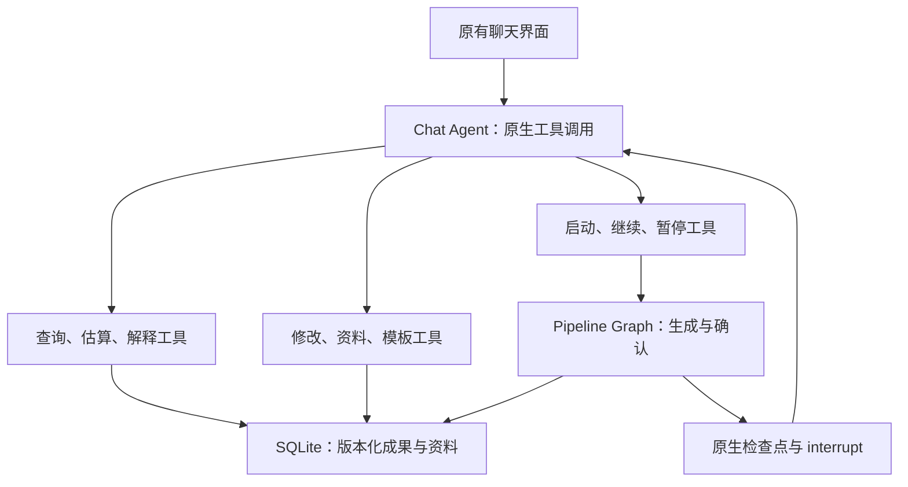

# v3.0.0：原生 Chat Agent 与 Pipeline Graph

用户提供的 Agent-Supervisor 方案已作为本版实现基础。聊天与生成使用独立执行入口，保持原来的 React 页面和 `/api/chats/{id}/turns` 返回结构。

## 各层职责

| 模块 | 职责 |
| --- | --- |
| `native_chat.py` | LangChain `create_agent`；模型通过 `tool_calls` 选择工具；将真实工具结果组装为兼容的 TurnResponse。 |
| `tool_registry.py` | `@tool` 参数、项目和产物范围、冻结的确认对象、调用领域服务。不会解释一份模型生成的 JSON 命令计划。 |
| `pipeline.py` | 生成顺序、四个确认点、原生检查点、恢复及回改上游后的重新确认。 |
| `native_business.py` | 理解、生成、评审、修改、澄清、估算、模板字段补全；校验引用、关联和人工字段保护。 |
| `native_model.py` / `model.py` | `bind_tools()` 模型、网关认证与超时、原生函数结果验证、服务器容量错误。 |
| `storage.py` / `operations.py` | SQLite 短事务、产物版本 CAS、历史版本、不可变证据及写入凭据。 |
| `native_views.py` | 从真实检查点读取当前待答问题；为原页面投影步骤与关联状态，不建立第二套状态机。 |
| `native_migration.py` | 已知旧确认点迁移；无法可靠恢复的旧任务保留数据并说明如何重新开始。 |

## 主流程

需求理解后，如有必要问题，先进入澄清确认；答案应用后检查未答问题。Human 依次确认需求理解、场景、用例草稿、评审结果。Auto 使用相同生成节点，跳过例行确认；业务澄清和明确暂停仍会形成原生中断。

每个生成节点只负责读取数据库、调用模型、校验、保存成果指针。确认节点单独调用 `interrupt()`。恢复时 LangGraph 会从被中断节点的开头执行，所以确认节点里没有再次生成或创建成果的副作用。

图状态只有 `run_id`、`project_id`、`chat_id`、三个成果指针、当前成果指针与阶段名。原文和完整成果保存在业务数据库中。暂停后当前图调用返回，后续凭原 `thread_id` 和检查点恢复；不存在占着计算线程等待聊天输入的循环。

## 中途交互

| 用户消息 | 工具行为 | 主流程位置 |
| --- | --- | --- |
| “只估算这些场景需要多少条用例” | 读取所选场景，返回区间、理由与假设 | 保持原确认点，不创建用例 |
| “解释这条用例” | 读取用例和关联证据 | 保持原位置 |
| “把场景标题改清楚” | 校验版本后保存所选条目 | 等待确认修改后的场景 |
| “先给我看修改预览” | 保存独立建议，不改正式成果 | 新的预览待答提示 |
| “同意” | 只处理发送本条消息时已展示的那一个确认对象 | 后续新提示必须另行回复 |
| “采用补充文件更新需求理解” | 采用指定资料，保存更新后的理解 | 实际检查点回到理解确认；确认后更新关联场景 |
| “把澄清保存到项目” | 保存可复用资料及引用 | 不因此批准主流程 |
| “学习场景与用例模板” | 分别生成两套列配置建议 | 确认后应用 Profile，不覆盖另一类模板 |

回改上游使用真实 `graph.aupdate_state()` 调整对应检查点，再进入该成果的确认节点。下一生成节点从 SQLite 读取最新父成果，比较行级来源关系后更新受影响的子条目。未关联的分支不会被合并；修改下游也不会跳过已经等待的上游确认。

## 数据与并发

原生 Checkpointer 管理图的执行位置；数据库事务和版本 CAS 管理业务写入。它们解决不同的问题：检查点不能代替数据库事务。

同一进程中的短期异步会话锁协调实际修改与继续，暂停期间不持有这把锁。没有 `_edit_token`、`_control_hold`、`boundary_node` 等持久化控制字段参与新任务。运行中的生成步骤可以继续被查询；要求修改时先停在本步骤保存后的确认点。

同一客户端消息编号的重发返回已记录结果；同一回合重复的同参数工具调用复用结果。修改、模板应用和继续均校验本轮冻结的对象与版本。工具失败不能被模型的自然语言“成功”覆盖。

## 模型与上下文

聊天通常只带当前确认点、近期消息摘要以及资料/成果目录。模型可按需调用读取工具，不默认把所有文档带进每一句聊天。业务节点按阶段读取所需资料和父条目，生成用例和评审使用关联证据。

业务结果通过一个声明的原生提交函数返回，函数参数有数据 Schema；不再要求模型用自然语言输出 `operations: [{op: ...}]` 代替 API。参数协议错误最多进行一次纠正，业务引用或版本错误保持明确失败，不无限循环。

没有本地上下文容量门槛。服务器明确拒绝可拆分业务批次后，才拆分当前批次，已经成功的批次缓存复用。单个不可拆分条目或聊天上下文超限会保留成果并提示处理，不重新执行整个聊天回合中的写操作。多批需求结果目前做条目/报告归并，未新增独立的全局语义归并阶段。

## 删除与兼容

模型调用与流水线事件沿用原界面的进度协议：调用开始、发送记录、返回内容、阶段完成、等待确认及任务结束。原生工具响应在完整返回后进入执行记录，并标记为非流式；不会伪装成逐 Token 流式生成。进度写入失败不改变业务结果，查询检查点也不会重复追加完成或等待事件。

已删除旧 `conversation.py`、`turn_graph.py`、`workflow.py`、旧执行引擎及 boundary / detour 控制模块。旧架构测试移入 `legacy-tests/`，不会作为新版主流程契约继续执行。

保留前端业务源码、现有路由和成果表。旧的编辑、历史恢复及模板字段补全 API 接到同一原生领域服务。历史产物可继续读取；迁移无法确定安全位置时提示重新开始，不猜测旧任务已经得到确认。

实现依据：[LangGraph interrupts](https://docs.langchain.com/oss/python/langgraph/interrupts) · [LangChain agents](https://docs.langchain.com/oss/python/langchain/agents)。
