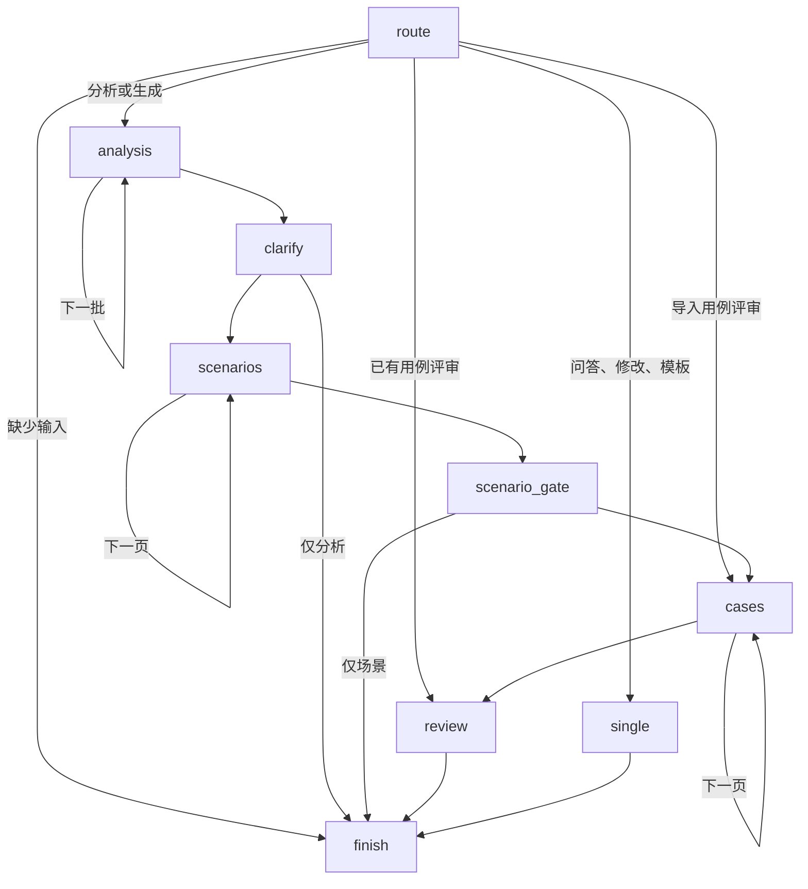

# 本地与云端双部署

本地继续执行 `python3 start.py`，使用原有 Python、FastAPI、LangGraph、LangChain、SQLite 和本机上传目录。`.env` 的读取方式、数据目录与历史检查点格式均未修改。

云端使用同一个 React 聊天界面，增加独立的 TypeScript Workers 后端。它使用真正的 LangGraph.js StateGraph 和 LangChain.js 流式模型接口；没有把 Python 解释器或本机文件系统放入浏览器。

| 行为 | 本地 | 云端 |
|---|---|---|
| 启动 | `python3 start.py` | 打开已发布的私有站点 |
| 模型配置 | `.env` 或本地设置 | 站点设置中保存一次，Key 加密保存；也可配置运行时环境变量 |
| 记录与检查点 | 本机 SQLite | D1，按登录用户隔离 |
| 上传原件 | 本机目录 | R2 |
| 任务推进 | Python 后台任务 | 打开的 SSE 响应持有执行权 |
| 关闭页面 | 后台继续 | 当前请求可能中止；重新打开恢复检查点，未完成的模型调用可能重发 |
| 本机 Ollama | 支持 | 需要可从云端访问的 HTTPS 服务 |

## 使用

打开云端站点后，在“模型与设置”填写模型名称、HTTPS 服务地址和 API Key，保存并测试连接。之后上传需求、选择任务类型并发送消息即可。运行时保持当前对话页面打开；收起执行过程面板不会关闭连接。切换到其他对话也可能暂停原对话的云端任务。

页面实时展示节点、批次、模型正文、校验、重试与人工确认。每次模型调用可以点击“查看发送内容”。这里保存的是交给模型适配器的完整消息和显式参数，不含认证信息，也不等同于服务商最终收到的 HTTP 报文。

模型每次请求的上限为 60 分钟，失败时最多自动尝试两次。平台或网络仍可能提前断开响应；应用保存的检查点和已提交结果会保留。重新连接时，过期执行权最多约 45 秒后可被接管；每 10 秒续期。接管或取消后，旧执行者的结果不能再写入。

## Graph



`clarify` 和 `scenario_gate` 使用 LangGraph interrupt。确认内容通过持久化 interrupt ID 恢复。每轮任务有独立的 Graph thread；跨轮对话由同一会话保存的最近 12 条消息、选中的需求来源及产物快照提供，避免把不同任务的执行游标混在一起。超出 12 条的历史不会自动全部发送给模型；历史聊天仍可查看。

节点状态只保存游标和产物引用。模型结果缓存、已验证分页、产物版本及最终消息存入 D1。产物与幂等标记在同一事务提交，重复恢复不会重复发布已提交结果。事务在数据库执行时检查版本和执行权，用固定事务标记保护整个批次。

## 开发与发布

Node.js 24 用于云端开发与测试：

```bash
npm ci
npm test
npx tsc -p cloud/tsconfig.json
npm run build
```

云端产物在 `dist/server/index.js` 和 `dist/client/`。原本地前端文件位于 `frontend/dist/`，云端构建不会覆盖它。前端独立开发方式见原 README。

Sites 发布使用 `.openai/hosting.json` 中已登记的站点，绑定 `DB` 和 `BUCKET`。D1 迁移来自 `db/schema.ts`，由 `npm run db:generate` 生成到 `drizzle/`；部署后不要修改已应用的迁移。部署包须包含这些迁移及构建产物。站点访问保持私有。

必须在部署运行时设置秘密变量 `TCG_SECRET_KEY`，内容为随机 32 字节的 Base64，用于 AES-GCM 加密用户模型密钥。不要提交到 Git。不要在已有加密配置的站点上随意轮换它；需要轮换时用户须重新保存模型密钥。

可选运行时变量：`TCG_MODEL_NAME`、`TCG_MODEL_PROVIDER`、`TCG_MODEL_BASE_URL`、`TCG_MODEL_API_KEY`。设置 `TCG_MODEL_NAME` 后，界面模型配置只读，优先使用这组变量。它们独立于本地 `.env`，不会自动上传本机密钥。

部署到自己的 Cloudflare 账号使用 `npm run deploy:cloudflare`，入口为 `cloud/worker.ts`。它验证 Cloudflare Access JWT 的签名、发行者、应用 AUD 和有效期，再覆盖内部身份头；所有 API 和静态页面均经过验证。配置、GitHub 自动发布和中断恢复见 [Cloudflare 发布步骤](CLOUDFLARE.md)。不要把 Sites 专用的 `cloud/server.ts` 直接作为独立 Worker 入口。

## 容量与验证范围

支持 DOCX、文本 PDF、XLSX/XLS、CSV、TXT、MD。上传上限 15 MB，Office 展开预算 32 MB，解析文本上限 200 万字符。扫描 PDF 不执行 OCR。单条存储记录预算 150 万 UTF-8 字节，单次模型上下文预算 50 万字符，模型输出预算 100 万字符；超出时明确失败，不截断后冒充成功。大文档应拆分上传或限定生成范围。

自动验证覆盖真实 LangGraph 的人工暂停/恢复、断线重连、并发执行权、取消、失败重试、多轮任务、分批分页、格式修正、版本、SSE、输入记录、模型配置和导出。D1 测试使用真实 SQLite 适配器；LangChain 流式传输使用模拟 HTTP 响应和测试密钥。没有使用用户的真实模型额度，真实服务的兼容性须通过站点“测试连接”确认。
