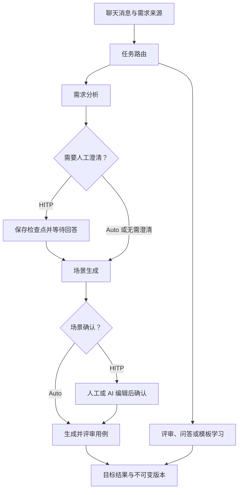

# 技术实现与交付范围

## 架构决策

用户要求：前端只保留聊天界面，后端使用 Python、LangGraph、LangChain，其余资源使用本地资源。此版本以原 TCG Case Agent PRD 的核心业务为基础实现独立本地应用。

| 部分 | 实现 | 作用 |
| --- | --- | --- |
| 交互 | React + Vite | 会话、输入、附件、结果卡片、人工确认和编辑 |
| API | FastAPI + Uvicorn | 提供同源 API、SSE 和编译后的前端 |
| 执行 | LangGraph StateGraph | 任务路由、节点执行、暂停、恢复与失败重试 |
| 模型 | LangChain ChatOllama / ChatOpenAI | 默认连接本机 Ollama，可配置兼容服务 |
| 业务数据 | SQLite | 项目、Profile、需求、会话、用例、任务、版本与审计 |
| 检查点 | AsyncSqliteSaver | 保存图状态和真正的人工 interrupt |
| 文件 | 本地目录 | 保存需求原件；本地解析并生成 XLSX |

不依赖云数据库、对象存储、Redis、外部登录服务或在线前端资源。默认仅监听本机回环地址，一份数据目录对应一个服务进程。

## 任务流程

上图展示完整用例生成路径。显式选择“分析需求”或“生成场景”时，在相应结果完成后结束。Auto 只公开本次目标产物；HITP 可在需求澄清和场景确认处暂停。

六个显式 Intent：review_requirement、generate_scenario、generate_case、review_case、query、learn_template。另有自动路由和产物定向 modify。模型返回结构化 JSON；服务端校验结构、条目 ID 和证据 refs。

Graph State 主要记录 ID、游标和阶段，正文通过本地数据库引用读取。任务由 Python 服务内的后台执行器推进，前端断开连接不会终止任务。服务器启动时恢复 queued / running 任务，waiting 任务保持等待。恢复人工暂停使用真实 `Command(resume=...)`。

## 数据一致性

- 同一聊天只允许一个活跃任务，由数据库约束执行。
- 产物编辑带 expected_revision；旧版本提交返回冲突，不覆盖最新结果。
- 写入前检查任务状态，阻止取消后的迟到模型结果；节点输出通过缓存和幂等写入应对重试。
- 暂停中的场景编辑使用持久化令牌和版本保护；服务重启后清理已退出进程遗留的编辑令牌。
- 历史版本不可变，恢复会生成一个新版本。
- 普通聊天指令不作为业务证据。上传、粘贴来源，或显式勾选“这条消息是需求正文”后才创建证据来源。
- 新生成任务尊重当前来源选择；针对已有产物的评审、问答和修改保留该产物的历史证据。

## 交付

完整 Python 和前端源码、预编译前端、锁定依赖、跨平台启动器、测试以及可选 Docker 配置。正常使用只需 Python；首次安装依赖需要网络。模型服务及权重由用户本机准备。

本实现是核心本地版本。未完成的企业能力、浏览器验收和真实模型效果等边界分别记录在 README 与 VALIDATION.md；不以自动化流程测试代替业务验收。
