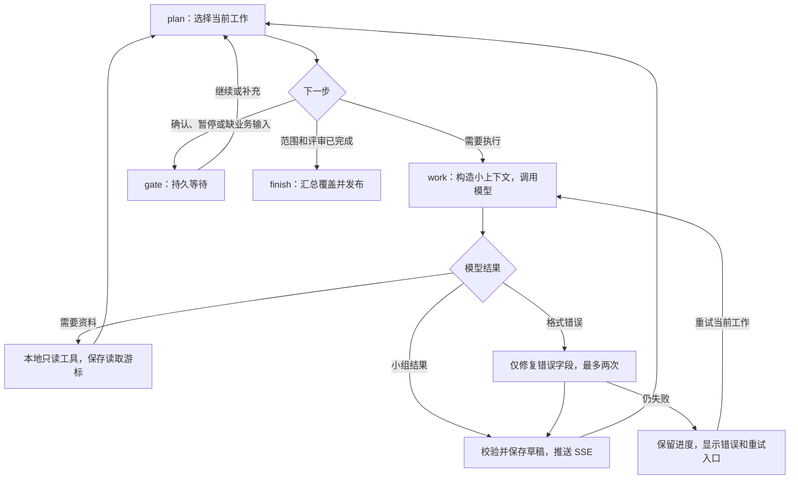

# 本地增量 Agent：当前实现

用户指定任务后，后台把资料分成可独立保存的小组。模型负责理解业务、选择测试方法、请求所需资料、提出修改；Python 负责已知依赖、分页、引用校验、版本和恢复。不再在每个步骤前后请求全局规划或最终总结模型。

## 实际 LangGraph

`IncrementalAgent` 编译的节点只有 `plan`、`work`、`gate`、`finish`。`plan` 是本地选择器；自动任务首次调用 `work_route` 识别目标和深度。显式任务跳过路由；无来源的直接聊天可能使用一次简短输入分类。



普通用例生成先逐组分析、生成场景和用例，再核查跨组依赖，最后进入一次 AI 评审阶段。评审可分组，但不以评分为门槛反复评审。后读规则影响旧草稿时，仅使受影响的组失效；关联检查等待新规则和节点保存后重新执行。跨组路径也有对应场景、用例和评审。

分析需求、仅生成场景、问答、修改已有成果、导入评审、学习模板各自止于所请求的目标。问答不用先做完整测试设计。模板学习只提出偏好建议，仍由用户选择应用。

## 每次发送什么

| 当前能力 | 默认输入 | 不默认携带 |
| --- | --- | --- |
| 路由 | 当前指令、来源目录、目标成果类型 | 原文、用例全集、全部聊天 |
| 分析 | 当前约 3,500 字符预算的证据组、相关配置 | 其他章节正文 |
| 场景 | 本组已接受规则、业务节点和分支 | 重复需求全文 |
| 用例 | 当前场景及其规则、适用类型 | 其他组用例 |
| 评审 | 当前用例组、相关关联、类型覆盖统计 | 用例全集和完整来源 |
| 问答 | 当前问题、最多两段相关本地检索片段 | 测试设计流程、无关配置 |
| 修改 | 当前选定条目及其作用域内的要求 | 未选中的完整成果 |

普通业务上下文上限为 16,000 个 JSON 字符；加系统和任务提示词的完整预算不超过 24,000 字符。日志中的字符估算不是上游 usage Token，也不用于承诺费用。不能容纳的业务对象会明确报错，不静默删去规则。

超长原始段落按偏移完整分片，共用原引用。工具读取每段最多 2,000 字符，返回下一偏移；每轮读取保留有界结果。跨组引用超长段落时使用 `from_units` 选择具体片段，不把同一引用展开回整段原文。

上传文件在本地解析，段落存入 SQLite，文档工作区按来源缓存。搜索采用英文词项和中文词组匹配，不调用外部向量服务。全文测试设计仍需覆盖全部来源分组；本次优化减少重复发送，不能把未读部分当作已处理。

## 工具与过程展示

模型通过普通 JSON 返回 `kind: need_context`，可使用 `search_evidence`、`read_evidence`、`list_sections`、`list_units`、`get_facts`、`get_dependencies`、`get_artifact_items`、`get_coverage_gaps`、`get_profile_fields`。不要求内网模型支持原生 function calling。

每轮最多四个只读请求，连续八轮仍无成果会出现可继续的查阅暂停。相同请求无进展重复出现则报告原因；继续可增加查阅轮次，有限字段修复不会变成无限循环。

SSE 展示工作项、来源、动作、结论、读取原因、阶段草稿、校验和失败。展示的是可核查的行动与业务摘要，不是私有思维链。支持流式的上游显示实际内容增量；minimal 非流式网关等待完整回复。每次调用仍可点开检查发给 AI 的完整内容，Header 值脱敏。

草稿始终只读，并且不作为下一轮自动选中的已发布成果。完成后保留草稿供回看，正式成果单独发布。最终关联覆盖校验失败时，不发布不完整成果，不覆盖已有成果版本。

## 多轮、恢复和配置

- 当前工作及结果保存在 SQLite。每次接受结果和事件同事务写入；重试和本版重启复用已完成工作。未完成的上游请求可能重新发起，不能从某个 Token 续写。
- 补充指令有版本号。模型返回后再次检查版本，过期回复不写入；影响检查读取规则或条目索引。已接受的局部修改作为下一次修改的基础，保留累积增加、删除和字段变更。
- 不把全部聊天记录发给模型。当前指令、持久来源和明确选定成果构成工作上下文；历史用例变更沿用目标成果版本。不同项目与未授权来源不能互相引用。
- 同一会话、相同来源/配置/模型/运行代码下，已接受的分析、场景和用例可复用；评审仍按本轮执行。
- 保留 `.env`、自定义 Header、minimal 接口与 3,600 秒模型超时。暂停在工作项边界生效，不能暂停上游已经接收的请求；停止可取消本地运行。
- 本次用户明确不需要旧任务迁移：v2 未完成检查点提示新建任务。来源、Profile、模型配置和已发布成果不删除。

## 本地验证

```bash
PYTHONPATH=backend python -m pytest tests -q
cd frontend
npm ci
npm test
npm run build
```

`test_incremental_agent.py`、`test_incremental_workspace.py`、`test_incremental_regressions.py`、`test_incremental_intake.py` 使用真实 FastAPI、LangGraph 和 SQLite，通过可控制返回/阻塞的模型验证：Auto 推进、只读草稿、局部恢复、过期回复、精确字段修复、长段落偏移、跨组规则更新、评审覆盖以及直接聊天输入。

受控单模块无额外补读/修复的完整生成是四次业务调用：分析、场景、用例、评审；自动识别目标再加一次路由。受控简单问答可一次完成。此结论不是实际网关耗时或业务质量测试。

四个历史 v2 测试模块通过仅存在于 tests 的 `legacy_agent_app.py` 显式运行保留的旧解释器，验证历史辅助契约；这些测试不用于证明新版产品行为。新版验收直接使用默认 `create_app`。

真实内网网关的排队、吞吐、输出正确性和 Token 用量仍须在用户本机验证。推荐新建聊天，先用短登录需求检查流程，再测试原大文档；出现问题时下载本轮诊断，核对 `runtime` 的图版本、协议和代码指纹。


## 校验失败后的自动恢复（2026-09-09）

当模型返回 JSON 但业务契约不通过时，当前工作项进入恢复流程：

1. 引用错误集中扫描 `items / nodes / edges / updates / evidence_review / operations.item` 的指定引用字段，每批最多 8 个；模型收到出错值、条目摘要、允许的 ID、当前证据的有界片段及最近错误记录。
2. 服务器只应用指定字段的修复；不会接受额外字段、整套替换或未经校验的引用。每次修复后重新执行完整契约检查。
3. 不再对整份回复共享“两次字段修复”额度。错误位置有推进时继续处理；连续两次没有解决当前错误时，自动带错误记录重新处理当前工作项/页。模型可以请求按需读取资料。
4. 修复草稿、最近错误和请求序号持久化到 SQLite；网络失败或服务重启后，重试接续修复结果。请求使用新的恢复序号，避免重复命中旧错误修复缓存。来源、上下文或指令版本改变时，不复用旧修复草稿。
5. 正常情况下修复通过后自动进入后续节点；一次恢复调用至多 12 轮，自动重新处理当前工作项至多一次。仍无进展时明确展示剩余字段并保存进度，不发布不完整成果，也不无限请求模型。

前端区分“修正已应用”和“工作项已通过完整校验”；后续字段报错不再把已应用的上一条修复标成同一次失败。过程、具体原因及模型发送内容可继续在 SSE 时间线查看。证据修复片段总预算 5500 字符；截断有明确标记，不发送整个文档。

回归入口：`tests/test_incremental_recovery.py`，覆盖多处引用、自动重新处理、按需补查、重启接续、无法修复时的边界、越界补丁及上下文预算。受控模型验证恢复机制，不代表内网模型一定能生成正确业务结果。
