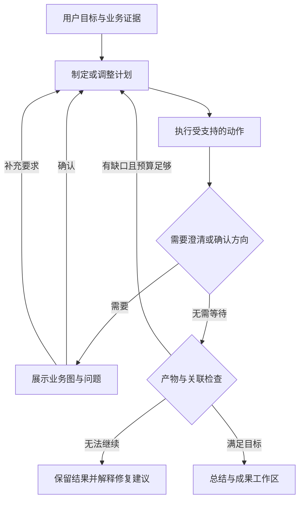

# 智能测试设计 Agent · v2.1

本版本保留本地 Python 服务、LangGraph、LangChain、SQLite 和原始数据目录。无需云部署。新页面默认发出 `experience: "agent"`，已有任务及省略此参数的 API 调用继续使用旧图。

## 一次任务怎样运行



这是运行机制示意，业务流程图由具体需求另行生成。实际 v2 图包含 `plan / work / gate / finish` 四个节点，通过条件边循环。模型在后端允许且满足前提的动作中选择；生成、分析、补充场景、修复用例和结束都有契约约束。模型不能任意执行代码或改变服务设置。

每次检查点在下一节点前持久保存。图状态主要存 ID、进度和确认状态，正文和证据从 SQLite 读取。规划最多 18 轮、定向修复最多 3 次；重复分析无进展会停止。结构化格式校验失败可带字段反馈修正一次，修正不能静默丢失原条目。预算不足会明确失败并保留阶段结果。

## 深度与专业方法

| 方案 | 用途 | 重点 |
| --- | --- | --- |
| AI 推荐 | 不了解如何选择时 | 模型根据风险、状态、依赖和不确定性选择并说明原因 |
| 快速设计 | 小改动、初步评估 | 核心正常路径、关键失败和高风险边界，明确未展开的范围 |
| 标准设计 | 日常功能需求 | 等价类、边界值、正反向路径、适用的决策条件 |
| 深度设计 | 状态多、组合多、跨模块需求 | 状态迁移、决策表、角色组合、异常恢复与跨系统风险 |

这些是设计策略，不保证固定条数、测试耗时或无缺陷。确认后深度不会被后续规划悄悄改掉。所有用例仍需检查步骤、预期和业务依据。

## 看得见的分析

界面展示模型提供的简洁分析摘要、选择理由、业务问题、依据与当前动作。不会虚构进度百分比，也不读取模型独立的私有 reasoning/thinking 字段。原始结构化响应保留在“查看调用详情”，并通过 SSE 逐步到达；它在校验完成前可能不是完整 JSON。

业务节点和连线用稳定 ID 及来源引用描述，由后端确定性转换为 Mermaid，浏览器用本地依赖绘制，不调用外部图表服务。危险交互、HTML 和过大图表被拒绝；绘制失败时仍能查看分析及源码。图可放大、下载 SVG 和 Mermaid 源码。

场景和用例带需求 ID 与业务分支 ID。成果中的关联表可核查需求 → 分支 → 场景 → 用例。覆盖数字只统计已确认模型中的关联；不能证明全部真实需求已经被识别，更不代表测试已执行。修改或删除用例后会重算或使旧覆盖结果失效，避免保留虚假的满覆盖。

## 多轮对话与补充

确认的范围、用户补充、开放问题、假设和证据随会话保留；不会只依赖最近十二条聊天。模型假设不会因为写入摘要而成为确认需求。新证据与旧决定冲突时，旧决定可标为被新证据取代。

运行中可以直接发送补充要求。后端先保存指令和版本，再在安全边界重新规划；旧版本调用即使返回也不能覆盖新范围。当前正在等待的模型请求不会立即强制中断，补充会在其返回后的边界应用；需要立刻终止时点击“停止”。关闭页面不停止后台任务。

编辑其他已有成果须等当前任务完成。已完成版本可在工作区选择部分条目后交给 AI 修改；手工编辑、冲突检测、历史恢复和 Excel 导出继续可用。

## 配置自定义 Header

在“模型与设置 → 自定义请求头”填写一个字符串键值 JSON 对象。例如：

```json
{"X-API-Key":"your-key","X-Tenant-ID":"your-tenant"}
```

- 使用 API Key 的 Bearer 鉴权时，可附加租户等自定义头。
- 若鉴权完全由 Header 提供，选择“仅使用自定义 Header”。显式 `Authorization` 也使用此模式，避免与 API Key 冲突。
- 空白保留当前配置；填写对象替换整个集合；清除操作需要显式勾选。
- 更换地址/provider 后旧凭据不会继承到新端点。接口重定向不会自动跟随，请填写最终地址。
- 页面保存的值在本地加密，重新打开只显示名称。请求快照里的头值全部脱敏；它是调用配置记录，并非网络抓包。

也可在 `.env` 一次配置：

```dotenv
TCG_MODEL_PROVIDER=openai
TCG_MODEL_BASE_URL=https://your-gateway.example/v1
TCG_MODEL_NAME=your-model-id
TCG_API_KEY=""
TCG_MODEL_AUTH_MODE=headers
TCG_MODEL_HEADERS_JSON='{"X-API-Key":"your-key","X-Tenant-ID":"your-tenant"}'
TCG_MODEL_TIMEOUT_SECONDS=3600
```

复制根目录 `.env.example`，修改自己的 `.env` 后重启。环境配置生效时页面只读，不会把 `.env` 内容写回设置文件。优先级和数据迁移规则见 README。

测试连接走真实流式 JSON 路径，检查连接、鉴权和最小结构化响应。任务超时仍为每次模型调用 60 分钟；无法改变提供方自己的网关超时。

## 失败后怎么做

| 界面问题 | 下一步 |
| --- | --- |
| 鉴权或配置错误 | 在模型设置核对最终地址、模型名、鉴权方式和 Header，测试通过后手工重试 |
| 字段校验失败 | 展开调用详情，检查具体字段和发送内容；模型配置问题可修正后重试；需要改变业务要求时新建任务 |
| 业务问题未明确 | 回答澄清问题，提供原文依据，不用猜一个答案继续 |
| 覆盖修复没有进展 | 查看遗漏的需求/分支，另起一个任务，补充明确规则或缩小范围；重试不会重置修复预算 |
| 图表无法绘制 | 产物仍保留；查看 Mermaid 源码，在聊天中要求修正业务图 |

重试利用已有检查点；未完成的模型调用可能重新发送，不会从旧 token 中间接着生成。诊断日志、请求快照和产物版本分别保留，方便核查。

测试范围与实测限制见 [验证记录](VALIDATION.md)。
