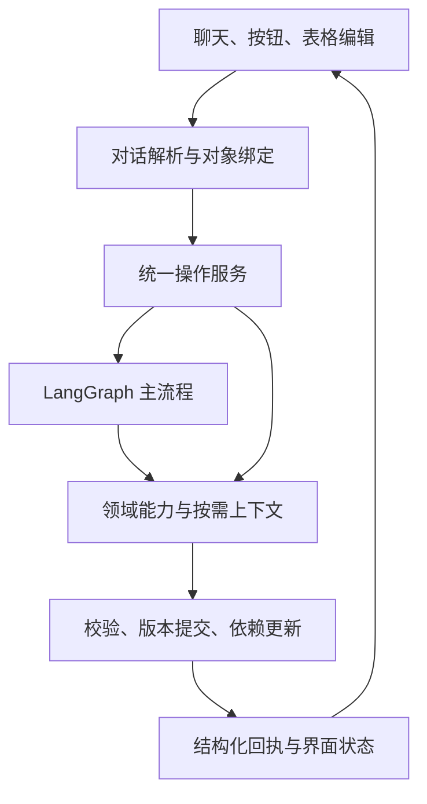

# TCG 对话主导的测试设计协作方案

设计日期：2026-09-12。状态：供本轮讨论的目标方案，尚未实施。依据：最近几轮明确的用户要求、旧 UI 设计记录，以及恢复的 v2.8.0 源码包只读核查。本轮未修改应用代码、未运行应用测试。本方案收敛此前设计中相互冲突的交互规则。

## 1. 产品中心与设计决定

TCG 的工作对象是有依据、可修改、相互关联的测试设计成果：需求理解、场景、用例和评审结论。用户通过对话推进这些成果，也可以在任何阶段查看、提问、补充和修改。

推荐组合是：**对话作为统一入口，版本化成果作为共同数据，LangGraph 保持主流程和人工确认。** 灵活请求调用同一组领域能力；生成流程、聊天、表格编辑和快捷按钮共用提交规则。

| 可选组织方式 | 适用性与取舍 |
| --- | --- |
| 固定向导，每类操作增加专门按钮 | 核心生成容易理解，但对话和流程容易分离，后续操作持续增加页面负担 |
| 由自由 Agent 决定全部步骤 | 表达灵活，但人工确认、继续位置和修改范围更难稳定约束 |
| 对话调用受控能力，LangGraph 管主流程（推荐） | 保留已有生成路径；对话可以组合操作；确认、版本和依赖由程序统一保障 |

本次设计以七项可观察行为作为完成标准：主流程能连续运行；人工模式每个主要阶段都能确认；对话可识别具体操作；局部修改有准确范围；新资料能进入指定阶段；关系和更新状态体现在数据里；项目结论可以复用。

## 2. UI 基线：沿用原来的红色 UI

此前《TCG需求分析与技术建议》第十节明确记录了视觉参考：`ly061/execution-agent-UI`，提交 `8bda3bd9f5321e8ca131e593637849a7575a1219`。其中指定白色侧栏、浅灰工作区、红色强调按钮、顶部项目导航和统一输入框。

本次继续采用这套既有视觉语言。红色用于沿用原版的主操作与选中状态；背景、表格和正文保持原版的中性色。具体颜色、字号、圆角、图标和组件状态以原参考源码与画面为准，不在本方案另创一套主题。

核查范围：已读回旧设计记录；本轮未重新取得该提交的可用界面截图，因此本文件是交互与工程方案，不是已经完成视觉比对的高保真稿。实施前应从原版提取视觉变量，并以同一视口比对入口、确认卡片、表格和输入框。

### 2.1 页面组织

| 区域 | 默认呈现 | 展开后的行为 |
| --- | --- | --- |
| 左侧导航 | 项目与对话列表，可折叠 | 项目资料、已确认规则和 Profile 从现有项目入口进入 |
| 顶部 | 当前项目、当前对话；简洁展示自动/人工模式和当前阶段 | 需要时查看运行详情和历史版本 |
| 主体 | 占主要宽度的对话流；过程反馈与成果卡片自然穿插 | 点开成果，在当前对话中展开表格；支持专注查看 |
| 底部 | 统一输入框、附件入口、发送；只显示少量当前相关操作 | 选中场景/用例时，输入框上方出现可清除的对象标签 |

对话页宽度随窗口增长，成果表格使用可用主区域宽度；长段落保留适合阅读的文本宽度。默认不常驻一个挤占对话空间的独立成果工作台。专注查看表格时可以临时放大成果，保留紧凑输入入口；退出后返回原对话位置与选择状态。

空白对话只有简洁欢迎信息、可选快捷任务和正常高度输入框。输入框从两行起步，随内容增长到约六行后内部滚动；不为了填满屏幕而拉长。窄屏收起侧栏，表格在自身区域横向滚动。

### 2.2 对话里的四种主要内容

1. 普通回复：解释、总结、估算或简短操作结果。
2. 成果卡片：需求、场景、用例、评审；显示版本、数量、简述和展开入口。
3. 待处理卡片：澄清、阶段确认、用户要求的变更预览；仅当前有效卡片可操作。
4. 变更回执：改了哪些条目、哪些关联内容受影响、当前停在哪里，附查看变化与撤销入口。

阶段卡片随执行状态更新，历史聊天保留当时的成果版本。查看历史不切换正在执行的分支；如明确要以旧版继续，再建立相应工作版本。

同一时刻只突出一个与当前主流程相关的主要操作，例如“确认场景并生成用例”。已处理提示收起为简短记录，避免页面充满重复提醒。技术日志按需展开，不进入普通业务交互。

### 2.3 快捷任务与输入提示

快捷任务只帮助输入，不构成能力门槛。选择“学习模板”后，将“请学习附件中的模板，识别它是场景模板还是用例模板，并给出字段定义和应用建议”放入可编辑输入框，不自动发送，也不覆盖用户已经写好的内容；有草稿时可追加或替换所选文本。

问估算、解释、总结、修改或导出都可以直接输入自然语言。选中 S3 后发送“补一个异常条件”，系统绑定 S3 的稳定 ID 与当前版本；取消选择后不继续使用隐形范围。

## 3. 主流程：自动与人工共享同一条路径

逻辑阶段为需求理解、场景、用例草稿、AI 评审与交付。理解过程可以提出澄清问题；澄清是当前阶段的交互，不是另一套生成流程。用户只要求场景时，目标在场景完成处结束，不继续生成用例。

| 阶段结果 | 人工模式 | 自动模式 |
| --- | --- | --- |
| 需求理解完成 | 展示需求项、关键规则和未决问题，等待确认理解 | 满足输入条件后继续；保留可回看的成果 |
| 场景完成 | 展示场景与对应需求，等待确认场景 | 目标包含用例时继续 |
| 用例草稿完成 | 展示完整用例表，等待确认并进入 AI 评审 | 继续执行 AI 评审 |
| AI 评审完成 | 展示评审后的用例与修改说明，等待确认完成 | 保存最终成果并结束 |

人工确认控制业务阶段，不要求用户确认每个模型批次或每条日志。确认按钮和“理解没问题，继续生成场景”等对话使用同一个后台入口。项目模式、任务模式与明确的停止要求在开始时形成一份有效策略，后续不能由模型自行切换。

自动模式不会例行要求阶段确认；遇到无法据实继续的关键业务冲突或技术失败，可以等待处理。允许暂作假设的内容必须标明，不能把自动采用的假设写成已确认项目事实。自动模式下的“先停在场景”也是有效停止要求。

### 3.1 保存、采用、确认、继续的区别

| 用户行为 | 成果是否变化 | 主流程如何变化 |
| --- | --- | --- |
| “解释 S3 为什么这样设计” | 不变 | 保持原阶段 |
| “估算这些场景需要多少用例” | 不创建用例；可保存一条估算回复 | 保持原阶段 |
| “把 S3 的描述改清楚” | 保存场景新版本，附变化回执 | 人工模式仍等待场景确认 |
| “先给我看修改建议” | 生成待应用变更，不覆盖当前成果 | 保持原阶段 |
| “采用这个建议答案” | 保存用户确认与相关分析更新 | 解决该问题，不自动批准整个阶段 |
| “确认场景，继续生成用例” | 使用当前有效场景版本 | 进入用例生成，随后在下一个人工节点停下 |
| “改好 S3 后继续生成用例” | 先完成指定修改 | 明确的组合授权仅覆盖本次修改及本次阶段推进；成功后继续，下个人工节点仍等待 |

普通的“好”“可以”只在对象唯一时解析：上一条明确询问是否采用某个答案，就针对该答案；上一条明确要求确认当前阶段，就针对该阶段。有多个待处理对象时，只询问需要指明的对象，不能默认批准所有事项。

“只估算，先不要生成用例”包含只读操作与停止约束两部分。如果任务尚未生成用例，就保持这一停止边界；如果正在生成，先请求安全暂停再估算，说明已有成果是否已生成，不伪装成从未运行过。

### 3.2 修改期间的行为

只读聊天可继续。针对同一成果分支的写入按顺序处理；确认按钮显示“正在修改场景，完成后可确认”。普通确认请求不能在修改中推进或清除编辑状态。已明确授权的“修改后继续”登记为同一组合操作的后续动作，不通过抢跑确认实现。

人工模式或已暂停任务，修改成功后刷新当前版本，仍停在原节点，除非本条指令已经明确要求继续。自动模式下，若用户没有发出暂停、不要继续或新的停止边界，安全边界完成修改后继续原有目标；临时协调写入不新增人工门禁。修改失败保留原成果，暂停受影响的执行并说明可恢复位置；不能在未采用修改时假装完成了“修改后继续”。旧页面或旧消息上的确认不能批准用户未绑定的新版本。

## 4. 用同一个对话入口处理灵活请求

每条消息结合当前项目、当前工作分支、阶段、选中对象、附件和近期交互，解析为“动作、对象、范围、依据、继续策略”。动作可以组合，执行顺序以实际结果为依据。

| 自然语言示例 | 后台操作含义 | 用户看到的结果 |
| --- | --- | --- |
| “这十个场景大概要多少 case？不要生成” | 读取指定场景，按类型和深度估算 | 各场景数量区间、合计、估算依据与假设；用例数量不变 |
| “解释第三条，再补一个失败分支，先别继续” | 绑定当前可见第三条；解释；局部增改；保持阶段 | 解释、新版本及变化说明 |
| “只把选中的步骤写得更详细” | 修改选中 case 的步骤，保护范围外内容 | 表格显示具体步骤变化；ID 和人工填写字段保留 |
| “总结现有用例主要测了什么” | 读取当前用例及相关场景/需求 | 按业务主题总结，附可打开的用例关联 |
| “这份文件是补充，只更新登录场景” | 采用指定资料与范围；修订目标场景 | 场景变化及已有相关用例的更新提示 |
| “把受影响的用例也同步，然后继续评审” | 计算并执行相关更新；进入允许的评审步骤 | 更新回执与实际评审进度 |
| “导出场景，使用刚学的场景模板” | 绑定场景版本、独立模板与导出能力 | 可下载文件和本次导出范围说明 |

“微调”与“生成”都调用有约束的领域能力，微调默认输出局部增改删，不重新生成整个集合。用户请求不明确时先指出最小缺项，例如“你说的第三条是当前筛选表中的 S7 吗？”；明确对象不反复追问。

无法执行的能力应据实说明并保留当前阶段。不能因为一句话无法归类，就自动转成“生成全部用例”。

## 5. 新资料与联动：允许指定从哪里改

上传、采用资料、更新成果是三个不同动作。上传后先解析并显示用途建议，不自动改变当前成果；“这份是补充，用它更新场景”才登记本次资料采用与场景修改。

一次操作只采用被用户指定、或能够唯一确定的资料。项目里其他待处理附件不构成全局阻塞。每个结果保存实际使用的来源版本、用途与适用范围。

| 用户指定目标 | 本次直接更新 | 对其他成果的处理 |
| --- | --- | --- |
| 更新需求理解 | 修改受影响需求项和规则 | 相关场景/用例显示待核对；用户可要求继续同步 |
| 只更新场景 | 修改目标场景并保存新资料引用 | 涉及新业务规则时显示相关需求待同步；已有用例按影响显示待更新 |
| 只更新用例 | 修改目标用例的步骤、预期或其他指定字段 | 新规则未体现在需求/场景中时，关联处显示上游待同步 |
| 理解、场景与相关用例一起更新 | 沿依赖顺序执行必要更新 | 保留无关分支；报告本次处理与未解决事项 |
| 先判断这份资料影响哪里 | 仅生成影响说明 | 不采用、不修改、不继续 |

直接改下游时，允许增加有真实来源的新规则；引用原父级只能表明归属，不能冒充父级已经包含该新规则。记录补充依据与差异，后续可通过“把对应需求和场景也补上”消除差异。

新增或细化规则可以直接进入指定目标；与适用的项目确认事实真正冲突时，只澄清那个冲突点，不让新附件静默覆盖确认结论。用户明确指定新版本替代旧规则时，直接建立替代关系并执行相应范围的修改。资料较新本身不代表权威性更高。

更新原子需求 R7 后，沿 R7→S3→C8/C9 找到已知关联；新增全局规则还需要检查适用模块和其他潜在影响，不能只搜旧引用。初次命中代表可能受影响，核对后才决定具体修改。

仅调整表述、排序、导出列名或标签颜色，不默认使全部下游失效。范围、条件、阈值、权限、步骤行为和预期变化，才触发相应业务影响检查。

### 5.1 “继续”如何处理尚未同步的内容

继续前只检查即将使用的相关依赖。无关附件或其他成员新增无关澄清不使任务失败。

当下一步确实依赖过期内容时，直接在对话中说明，例如“场景 S3 已更新，C8、C9 还基于旧规则。需要先同步这两条再评审吗？”用户若已说“同步后继续”，直接按授权完成，不重复询问。

仍允许用户查看、讨论和导出当前版本；有差异的导出应记录其版本与待同步状态，不能把它称为最新一致版本。用户明确希望评审某个历史快照时，可以对该快照评审并保留归属，不能将该报告挂到更新后的版本。

### 5.2 完成后还能改

原运行和最终成果保留。后续修改创建新的工作版本，按实际影响执行同步或评审。只改一条用例无需重跑需求理解；只改场景且未要求用例更新时停在这次修改完成处。

“继续”优先恢复明确的暂停步骤或待完成目标。全部已完成且没有后续目标时，回复当前已完成，并询问需要更新、评审还是导出；不凭空重跑。

## 6. 关联与覆盖体现在成果里

一个需求可以对应多个场景，一个场景可以关联多个需求。每条用例继续保留现有字符串 `scenario_id` 作为主场景，不在这次改造中改成数组；通过主场景展开相关需求，额外证据引用不等于增加主场景。保留稳定业务 ID 和精确版本关联。若历史导入用例没有场景关联，显示“尚未关联”，不造一个虚假父项。

| 成果表 | 默认展示的关系 | 展开可见 |
| --- | --- | --- |
| 需求理解 | 需求 ID、规则摘要、相关场景数量、待澄清/待覆盖状态 | 原文依据、已确认规则、关联场景 |
| 场景 | 场景 ID/标题、类型、优先级、对应需求 ID 与短标题 | 需求完整规则、来源片段、关联用例和同步状态 |
| 用例/评审 | 用例 ID/标题、所属场景、对应需求、步骤与预期 | 父级内容、依据、具体评审问题和版本变化 |

可在成果表上方用简短文字说明“本轮范围内 12 条需求，10 条有关联场景，2 条待补场景”，点击数字直接筛选这张表。未覆盖需求需要在需求表明确可见，不能因没有下游行而消失。

必须区分：已建立关联、内容已检查、基于假设、尚无下游、待同步、明确排除。存在引用不能自动标为完整覆盖；分母是本次有效范围，排除原因可查。避免用一个总百分比掩盖业务规则未被实际测试。

## 7. Case Review 与微调的完整体验

评审阶段以表格作为主呈现。聊天用于指令、解释与总结；表格负责浏览、选择、比较和直接编辑。

| 列/信息 | 呈现规则 |
| --- | --- |
| ID、标题 | 左侧便于定位；大表支持固定列 |
| 类型、优先级 | 紧凑显示，支持筛选 |
| 前置条件 | 多行显示，可展开完整内容 |
| Step / Expected result | 相邻配对，保持同一步的动作与预期对应；专注模式显示完整步骤 |
| 场景、需求 | 显示 ID 与短标题，可展开来源 |
| 评审结论 | 问题、理由、修改范围；支持只看有问题或有变化的条目 |
| 模板自定义列 | 按当前 Profile 展示；允许选择可见列 |

默认行可以收起长步骤，但不能仅剩标题；至少显示首步与预期及总步数。展开行或专注模式可看完整信息。聊天中的“第二步”绑定到具体 case 和步骤，避免把它误解为第二条用例。

用户可以直接改表格，也可以勾选后说“把这些前置条件统一一下”。明确微调直接保存，展示差异和撤销；“先给我看建议”则进入预览。修改不覆盖已有人工执行结果、执行人、备注等受保护字段，除非用户明确要求修改这些字段。

一轮生成包含一个逻辑 AI 评审阶段，可容量分批。只读“解释评审意见”不会重新评审；评审后修改的条目显示需要重新检查，可按范围再评审。结构修复重试与新增一轮业务评审分别记录，不用无限评审追求分数。

## 8. 澄清进入项目，其他成员可以复用

项目资料区设置简洁的“已确认规则”入口，承接所有对话中的有效项目澄清；聊天同时显示“已保存到本项目”的回执。

每个需要回答的问题提供建议答案或明确标注的建议假设，说明来自资料、项目规则，还是尚无依据的提议。没有足够依据时，可以建议“暂列待确认，先覆盖不依赖此条件的路径”，不能编造确定的业务值。

采用后，当前待回答卡片移除该问题，历史中保留可展开的已处理记录。采用只是录入答案，不批准整个理解阶段。“先按这个假设继续”保存为本次任务假设；只有用户明确确认的业务结论才成为项目确认事实。

回答当前任务提出的澄清，或采用其建议答案，本身即授权当前任务使用这条结论：保存项目记录并更新相关理解，刷新待确认版本，不要求再点一次“采用到本任务”。其他成员在另一对话中提交的规则，不视为对本任务的即时更新指令。

| 聊天内容 | 保存位置和使用范围 |
| --- | --- |
| “确认，本版本移出白名单后立即撤销访问权限” | 项目确认规则，绑定模块/版本和来源消息，可由同项目成员使用 |
| “这次只测正常路径” | 当前任务范围，不改变全项目测试范围 |
| “步骤以后统一用中文” | Profile 的表达配置；按明确持久化意图应用 |
| 模型建议但用户未采用的答案 | 当前待处理建议，不作为项目事实 |

确认记录至少包括项目、规则内容、适用模块/版本、确认人、时间、来源、状态和被替代关系。已有明确答案按会话授权直接保存，不再弹一次“是否保存”。存在真实冲突时只澄清冲突点；明确说“从本版本改为……”时建立替代关系，保留历史。

其他有项目访问权限的成员，在同一服务与同一项目的新对话中可检索适用规则。独立安装、独立数据目录之间不会天然同步；团队复用需要连接同一项目后端。保留现有访问边界，不跨项目泄漏澄清。

新规则不静默改写历史成果或正在执行任务的输入。后续新操作使用适用的新版本；已有相关成果显示可能受影响。当前任务明确采用新规则时，在安全边界更新执行输入并只调整受影响部分。

## 9. Profile、模板与 Sample Case

Profile 保存输出规范：场景模板、用例模板、字段定义、表达规则和选定样例。项目确认规则保存业务事实。两者分别参与上下文构造，避免模板内容被误认为当前业务要求。

场景模板和用例模板使用独立的结构字段；学习其中一类不能覆盖另一类。混合附件可识别两类并分别展示学习建议。应用时明确对象和版本；已有字段映射、自定义字段和填写来源约定继续保留。

用户勾选已生成用例后说“把这几条保存为项目样例”，保存所选版本快照，不收录整个结果集，也不把模型当前输出自动设为长期规范。样例可替换、移除，原用例后续变化不偷偷改变样例快照。

后续生成只提取适用的格式和写法参考，不复制样例里的账号、阈值或预期业务行为。样例不能成为需求证据引用。实际执行结果等人工数据也不作为未来用例的默认值。

场景和用例均可通过对话或成果卡片导出，使用各自模板。必填 AI 字段按模板检查和补全；人工字段不编造。解释与总结可以使用这些成果及其关系，但不自动调整 Profile。

## 10. 后端组织：已有能力收敛到共同契约

保留现有后端部署、LangGraph 和领域存储。模块名称在下图表达职责，不要求分别部署服务。

### 10.0 现状核查与复用位置

以下路径位于已恢复的 `tcg-case-agent-local-v2.8.0.zip` 内。源码存在这些能力不等于整套新体验已经验收通过。

| 现有模块 | 本次复用与调整 |
| --- | --- |
| `backend/tcg/conversation.py`、`capability_contracts.py` | 已有能力识别与顺序执行；统一对象、效果和继续语义，沿用现有入口 |
| `backend/tcg/workflow.py`、`conversation_workflow.py` | 已有四个人工 gate；让按钮和聊天绑定同一个有效等待对象与版本 |
| `backend/tcg/conversation_artifacts.py`、`artifact_actions.py` | 已有估算、解释、微调、预览和联动；复用其目标选择与局部写入 |
| `backend/tcg/workspace_changes.py`、`conversation_project.py` | 目前新资料协调倾向强制先更新 analysis 再同步全链，部分路径拒绝选中条目；改为本方案的按目标采用与局部更新 |
| `backend/tcg/dependencies.py`、`workspace_coverage.py` | 复用版本与关联数据；保留真实冲突保护，移除未采用资料造成的全局阻塞 |
| `backend/tcg/clarification.py`、`project_context.py` | 复用已有项目澄清与样例基础，补齐范围、替代和冲突语义 |
| `backend/tcg/context_service.py`、`context_budget.py`、`context_receipts.py` | 复用按需上下文与输入清单，所有新入口都走同一预算规则 |
| `frontend/src/App.tsx`、`ArtifactWorkspace.tsx`、`ArtifactCard.tsx`、`WorkspaceCoverage.tsx` | 当前成果主区加旁侧聊天需改成对话主区；已有步骤/预期子表可复用，父级关系移入成果行 |

其中两个重点是：当前资料守卫将新增业务附件普遍要求先纳入 analysis，需要收窄为本次真实使用的范围；当前 UI 将关联展示放在独立折叠区，需要复用其数据并调整展示位置。无需为这两项重写模型网关或另建总控引擎。

### 10.1 各层只承担一种决定

| 层 | 负责 | 必须由其他层提供的约束 |
| --- | --- | --- |
| 对话解析 | 理解意图、对象、范围和多动作顺序；按需补问 | 能力白名单、有效项目/成果目录、当前流程位置 |
| 统一操作服务 | 绑定版本、幂等登记、按范围排队、组合步骤和返回回执 | 能力输入契约、权限、依赖前置条件 |
| LangGraph 主流程 | 阶段顺序、自动/人工策略、暂停与恢复 | 实际成果版本、有效确认、操作提交结果 |
| 领域能力 | 理解、生成、修订、评审、估算、解释、同步、学习、导出 | 当前任务的最小上下文与严格业务结构 |
| 领域存储 | 不可变成果版本、资料、项目事实、Profile、关联与回执 | 原子提交和预期版本检查 |
| 前端状态投影 | 显示当前阶段、成果、选区、待处理项与操作进度 | 服务端快照与有序事件；不自行推断流程推进 |

对话执行保留独立于长任务的短生命周期：一次问答结束不等于整个 Run 完成；一个 Run 等待确认也不妨碍新一轮只读对话。现有对话控制模块继续复用，不再新建另一套与主流程竞争的总控状态机。

模型可以建议注册能力、参数和次序；程序校验后执行。模型不直接写数据库、清除等待节点或选择任意图跳转。

### 10.2 统一操作契约

每次已绑定操作记录以下信息，具体类名可沿用现有代码：

| 字段组 | 核心内容 |
| --- | --- |
| 身份 | command/turn/run/project ID、用户身份、幂等键 |
| 对象 | artifact ID、基线 revision、条目 IDs、来自哪个视图的选择 |
| 意图 | capability、参数、约束、保护字段、是否仅预览 |
| 依据 | 本次采用的来源、项目规则、Profile 和父级版本 |
| 控制 | 保持位置、在指定阶段停止，或本次操作成功后继续 |
| 结果 | 实际修改、产生的版本、影响项、待处理事项、实际流程位置 |

“读/预览/写/流程控制”的效果由能力在服务端声明，不能只相信模型输出的副作用标签。确定性的导出、统计和版本读取直接执行，无需额外调用模型。

变更回执建议统一成自然语言：“已更新 S3；C8、C9 需要同步；当前仍等待场景确认。”回复必须由实际提交结果生成，不能把模型的计划写成完成事实。

### 10.3 版本与并发：消除笼统的依赖变化失败

采用成果身份、条目稳定 ID、不可变 revision 和精确依赖清单。依赖清单包含实际读取的父项业务指纹、来源版本、相关项目规则及 Profile 中实际使用的部分；必要的全局规则也必须列入。

操作开始时绑定输入；提交时检查目标和实际依赖。生成批次自身写入、评审报告措辞变化或其他模块新增资料，不应使同一个任务自我失效。若只因容器版本变化而相关条目未变，应进行可验证的兼容判断，不能仅比较整个项目的更新时间。

针对同一分支的修改串行提交。命令幂等键保证断线重试不重复创建用例；跨进程恢复先检查已有回执。人工确认记录绑定阶段与当前工作版本，确认与修改使用同一个服务端协调机制。

真实冲突时，不再只显示“依赖已改变，请重新生成”，而是给出具体对象：“本批使用 S3 v2；当前 S3 已是 v3。本批结果尚未应用，其他批次已保存。可更新这部分后继续。”旧模型输出不能覆盖新版本；只有确受影响的工作项需要重算。

LangGraph 的持久化检查点可支持暂停与恢复；恢复 interrupt 所在节点时，节点前部逻辑可能重放，因此数据库副作用仍需幂等回执保障。[LangGraph interrupt 文档](https://docs.langchain.com/oss/python/langgraph/interrupts)

### 10.4 运行中变更与恢复

只读请求绑定可用成果快照，说明必要的版本。写请求到达后，停止派发相关后续工作，在当前批次可持久化的边界处理；不能等待整个大任务全部结束后才接受变更。

当前在途调用可以在旧快照下完成并留存候选结果，但与已采用新输入冲突时不得提交为当前版本。未受影响工作复用；相关工作按新快照恢复。失败只重试相应工作项，刷新页面后从服务端状态和事件游标恢复。

主流程 checkpoint 主要保存阶段、控制策略版本和成果引用；项目事实与成果保存到持久化业务存储，不放进一个不断增长的聊天状态。检查点与跨会话数据分别管理符合 LangGraph 的持久化边界。[LangGraph persistence 文档](https://docs.langchain.com/oss/python/langgraph/persistence)

## 11. 大文档与上下文预算

文档解析一次，保留片段、位置和索引。每次请求按能力构建上下文，并保存实际输入清单，供诊断和复现。

| 操作 | 默认上下文 |
| --- | --- |
| 对话路由 | 当前阶段、能力目录、成果/文件元数据、选择范围、相关近期交互；不带全文 |
| 全需求理解 | 先判断是否可单批；超预算后按结构分组，全量登记处理范围，并做跨章节归并 |
| 场景/用例生成 | 当前工作项、相关父级、必要项目规则和原文证据 |
| 局部修改 | 目标条目、用户约束、必要父级、指定补充资料片段和受保护字段 |
| 估算/解释/总结 | 当前成果与相关关系；涉及精确业务断言时补取证据 |
| 模板学习 | 指定模板的结构、字段说明与少量代表样例 |

计算完整输入、输出预留与安全余量后再决定分批。模型上下文容量在配置中明确；未知时使用已标注的保守配置，不把 0 当作无限容量。预算不足时拆工作项或检索更多页，不静默丢需求。

检索用于补充证据，全量任务另有处理台账。Top-K 结果不能充当全需求覆盖。问答可以按需继续检索，但设有明确调用预算；不足时说明缺少什么。缓存绑定来源、规则、Profile 和模型/提示版本，避免复用过期业务内容。

## 12. 一次连贯演示与验收

建议使用同一个“登录权限”演示项目。准备主需求文档，说明正常登录、白名单入口、无权限拒绝；故意不说明移出白名单的生效时机，也不规定审计记录。另备一份补充文档，明确新增规则：“会话期间被移出白名单时，下一次受保护操作被拒绝，并记录审计事件；已保存的业务数据保持不变。”这份补充暂不规定审计字段。再备场景模板、用例模板。以下示例句中的 ID 以现场实际生成条目替换；新增规则均为演示输入，不是对真实项目事实的推断。

| 步骤 | 输入或操作 | 必须观察的结果 |
| --- | --- | --- |
| 1 | 人工模式上传主需求：“按人工确认方式生成测试用例，每个阶段等我确认。” | 需求理解后停下；尚未生成场景 |
| 2 | 对生效时机问题采用建议答案，或回答“本版本移出白名单后立即生效” | 待回答提示消失；项目已确认规则可见；仍需确认理解 |
| 3 | 同项目另一成员新建对话：“项目怎样处理移出白名单？” | 引用适用项目规则及来源；原对话状态不变 |
| 4 | 回原对话：“理解没问题，继续生成场景。” | 生成场景并停下；每行可看到对应需求 |
| 5 | “只估算这些场景大概要多少 case，不要生成。” | 返回分场景区间与假设；没有新 case；仍等待确认场景 |
| 6 | 选择一个场景：“先解释这条，再把异常条件写清楚，先不要继续。” | 解释和局部新版本可见；其他条目保留 |
| 7 | “确认当前场景，生成用例。” | 使用修改后的版本生成；停在用例草稿确认 |
| 8 | 打开用例表，展开一条 | 可见完整前置条件、配对步骤/预期、场景和需求 |
| 9 | 上传补充文档：“这是补充，只修改这条撤销权限的用例。” | 只改目标与明确范围；保存新依据；新规则与上游差异在关联处可见 |
| 10 | “把对应需求、场景以及确实受影响的用例也同步，先别评审。” | 局部联动；稳定 ID、无关用例和人工字段保留；仍停在用例确认 |
| 11 | “确认用例，开始评审。” | 运行一次逻辑 AI 评审；结果以表格展示；随后等待确认完成 |
| 12 | “解释这些评审修改，再总结用例覆盖了哪些业务。” | 输出关联到实际用例的解释和总结；不会再次生成或自动确认 |
| 13 | 勾选撤销权限用例：“把权限检查步骤拆成发起请求和核对拒绝结果两个步骤，保留业务预期，先给我看变化。”然后“采用修改” | 先预览，再保存；只改指定范围；该条显示评审结论需更新 |
| 14 | “复查刚修改的用例。”随后“确认完成。” | 有范围的复查；确认最终版本完成 |
| 15 | 选择满意用例：“保存这几条为项目 Profile 样例。” | Profile 可查所选版本；后续生成借鉴写法，不引用样例业务事实 |
| 16 | 选择学习模板快捷任务并分别提供两类模板；应用学习建议 | 输入框自动填写可编辑提示；两类模板独立保存 |
| 17 | “按各自模板导出场景和用例。” | 两个导出使用各自字段；自定义内容、来源关系及待处理状态如实反映 |
| 18 | 完成后：“新增确认：审计记录应包含操作人和时间。把这个规则补到权限撤销场景，并同步受影响的用例。” | 保存有范围的项目确认；原完成版本保留；创建局部工作版本；新增校验可见；不重跑全部需求理解 |
| 19 | 新对话自动模式，用已确认规则重新生成 | 主流程连续完成；可回看成果；没有例行人工门禁 |

这些是目标验收步骤，不表示本轮已经测试通过。另补四项定向故障验收：修改中重复确认、模型迟到结果、处理期间新增无关项目规则、刷新/重连。它们分别验证门禁、版本保护、依赖粒度和恢复能力。

## 13. 实施收敛与交付边界

按完整纵向路径分批收敛，避免先增加一排按钮再补后台：

1. **统一控制与回执。** 明确主流程阶段门禁、组合操作、输入版本和真实依赖检查；先跑通“人工场景确认 → 聊天修改 → 使用新版本继续”。
2. **统一对话与成果展示。** 复用原红色 UI；将成果、确认和局部变化放回宽对话；补齐表格步骤/预期和内嵌上下游关系。
3. **统一变更和项目复用。** 打通指定资料采用、三种目标修改、局部联动、项目确认规则、Profile 样例、两类模板和导出。
4. **按同一演示项目验收。** 先用可控模型验证状态和数据契约，再以实际模型验证说法变化、长文档和业务质量；视觉单独对照旧版参考。

已有功能优先复用，主要改动落在它们如何共享状态、如何绑定对象、如何形成一致的用户体验。每项交付需同时具备聊天入口、有效业务结果、正确流程位置与可见回执，不能把“存在一个接口”当作已满足演示需求。

最终应呈现的体验是：用户一直在同一个对话里工作，随时能看懂当前成果来自哪里、刚才改了什么、接下来能做什么；后台始终知道自己在使用哪个版本、等待谁的确认、哪些工作确实需要更新。
