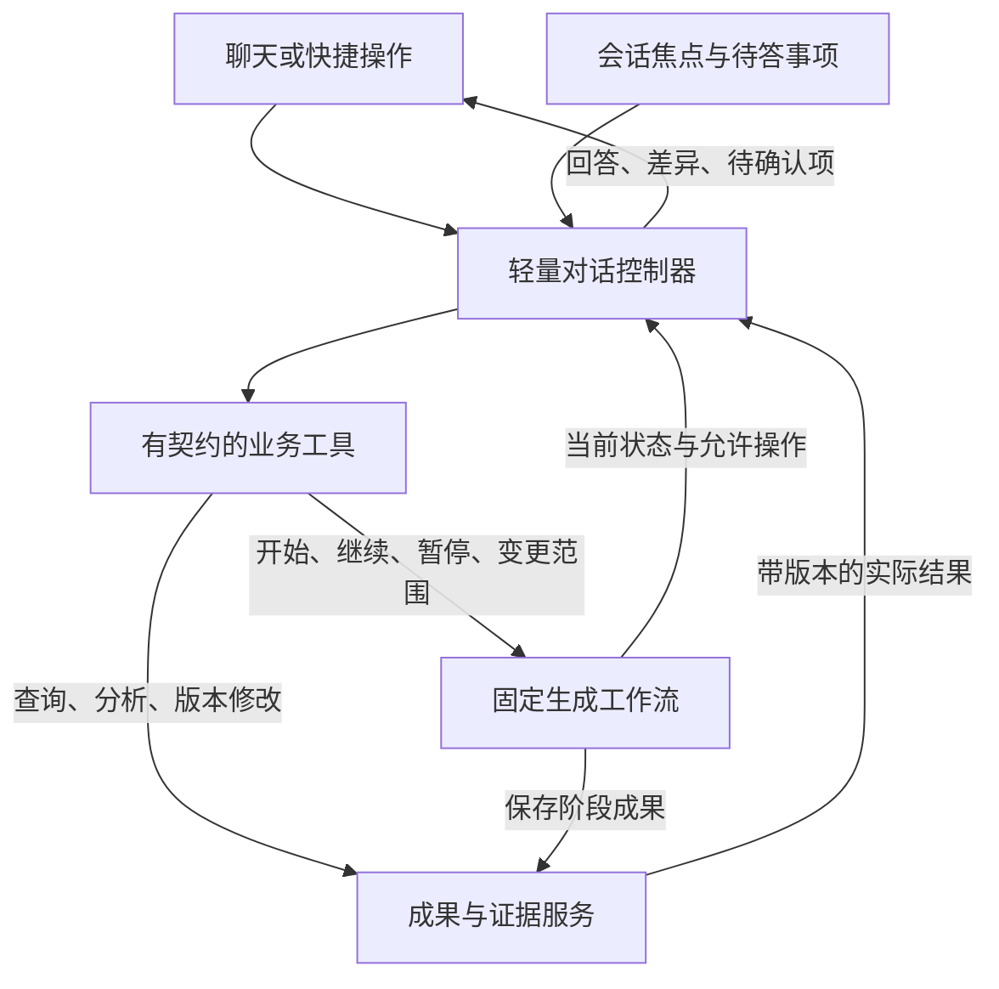

# TCG 后端方案：固定工作流与轻量对话控制

日期：2026-09-11。设计依据：v2.5.13 实际源码，以及用户对“核心流程明确、沿流程进行临时操作与其他分析”的进一步澄清。本文是收敛后的设计，已按全部已提出需求完成逐项文档复核并补充状态、展示与验收契约；尚未修改运行代码或发布新版本。文档覆盖不表示软件已实现或真实模型已通过验收。

**一、核心决定**

保留现有 LangGraph 负责“理解需求 → 澄清/确认 → 场景 → 用例 → 评审”。新增一个轻量 ConversationController，把本轮自然语言转成有限的业务调用。工作流自己知道下一阶段，对话控制器只决定本轮要查询、修改、补充资料还是控制工作流。

主流程、中间业务能力和对话入口共享同一套服务；不引入第二个能任意重排主流程节点的通用工作流引擎，也不为每种问法建立 intent 分支。复杂一句话可以形成几步短操作，但不预先规划整个项目的几十步任务。



三种路径的取舍：逐功能增加聊天特判会持续分散上下文与状态；完全自由规划会重复决定本来已知的生成步骤，并增加调用与恢复难度；固定流程加轻量工具控制器能保留稳定主干，又支持非预设的组合操作。这里选择第三种。

**二、状态只保存在它的责任方**

| 责任方 | 唯一持有的状态 | 其他层如何使用 |
|---|---|---|
| Workflow Run 与 LangGraph 检查点 | 当前阶段、运行/等待/停止、输入版本、业务范围、最终目标及持久停止条件 | 对话层读取摘要，只通过控制命令改变；不能直接写 current_stage 或跳图节点 |
| Artifact / Source / Profile 存储 | 实际内容、版本、引用、上下游关系、已确认项目澄清、模板和样例 | 工具读取明确版本或提交新版本；聊天回复不作为已保存成果的替代 |
| Conversation State | 当前讨论对象、回复指向、当前待答事项引用、本轮尚未完成的短指令 | 不复制当前阶段，不存一份需求/场景/用例全文，也不从无限历史猜最后一次操作 |
| Clarification Draft | run/interrupt、问题集合版本、草稿修订号、逐题答案与采用状态 | 澄清服务持有一份权威草稿；聊天、卡片及刷新恢复共用，不分别维护互不一致的答案 |
| Turn / Command Receipt | 客户端消息 ID、具体业务命令、输入版本、已执行结果、等待/失败/取消状态 | 用于重试、恢复和展示实际执行结果；不承担主流程推进逻辑 |

Run 与 Turn 分开。等待场景确认时解释、估算或总结是一次 Turn，不创建另一个生成 Run。项目共享只保存已确认知识与格式偏好；会话焦点“第三条”不共享给同项目其他用户。暂停、继续等控制命令不应被写成需求证据或项目事实。

待确认项只保存其权威对象引用：工作流确认指向 run + interrupt；修改确认指向 proposal + 输入版本；对话缺参问题属于未完成 Turn。真正的状态仍由对应对象维护，避免两处记录“已确认/未确认”发生分歧。

讨论对象解析依次考虑用户明确点名、回复的消息/待办、最近明确讨论对象和当前合法流程上下文。“页面自动展示了一个旧结果”不能覆盖明确语义。序号最终必须解析为实际条目 ID 和当时的排列版本；多个合理候选时询问唯一缺失信息。前端提交当前视图的成果版本、筛选和条目顺序作为定位线索，服务端验证其范围；不能把已排序表格的第三条误认为原数组第三条。

**三、每条消息的处理方式**

1. 保存消息和去重键，读取当前工作流摘要、讨论焦点、待答事项、成果目录及附件元数据。
2. 一次模型解释本轮要求：可以直接回答、缺少信息，或需要一个/几个业务调用。普通请求不强制经历“分类 → 规划 → 审核 → 总结”四次调用。
3. 程序解析目标，验证参数、权限范围、版本、效果类型和当前状态。缺参数就保存待答事项并询问；暂时不能写入则登记到安全边界执行。
4. 执行业务能力，保存真实结果与回执，再展示回答、表格、差异或下载文件。
5. 只有工具返回的新事实会影响剩余操作时，再进行有限的下一轮工具选择。已知主流程阶段不需要回到模型决定下一步。

例如“先解释第三个场景，再估算它的异常用例数”形成两个读取操作；“找出没有用例的场景，再补齐”先读取覆盖结果，再根据实际缺口确定修改范围。后一步引用前一步保存的结果，不预先编造新 ID。

短动作序列记录次序、参数和实际结果即可。暂不建立通用计划 DAG、反思代理、多代理协商或全面事件溯源。每轮设置工具次数和模型调用预算；达到预算就保留已完成结果和明确的未完成操作，不无限重试整个项目。

**四、业务工具目录与通用分析**

工具目录统一定义业务入口。最小契约如下，名称是设计示例，并非当前已有接口：

```text
Capability
  name
  input_schema / output_schema
  effect: read | write | control
  context_needs
  prepare(context, arguments): ready | needs_input | wait_boundary
  execute(context, arguments): result
```

效果分类、执行条件和校验由程序定义，模型不能把修改工具标成 read 以绕过规则。prepare 负责目标和版本解析；execute 复用现有业务函数。结果使用 succeeded / needs_input / needs_confirmation / deferred / failed / cancelled 等明确状态，包含实际成果与版本、必要证据、用户可见摘要。需要确认时绑定具体 proposal 或 interrupt；阶段本身处于等待不自动等于本次编辑还要再次确认。未知任务不能通过一段“已完成”回复冒充执行。

| 工具组 | 典型入口 | 执行边界 |
|---|---|---|
| 工作流控制 | start / continue / pause / cancel / retry / update_scope | start 指定目标终点，完整内部阶段由现有图执行；continue 绑定真实 interrupt |
| 澄清与项目知识 | adopt_answers / save_answers / share_answers | 采用草稿、提交保存和继续流程分开；可在一句明确要求里组合 |
| 读取与分析 | read_artifact / analyze / estimate / coverage | 读取明确版本；覆盖计数由代码算，文字和业务分析由模型生成 |
| 成果修改与评审 | revise / preview / apply / discard / sync_related / review_cases | 局部范围、引用、人工字段和版本校验统一执行；既有用例可独立评审，不要求先生成新用例 |
| 资料与项目配置 | add_sources / update_from_sources / learn_template / apply_profile / pin_samples | 来源用途、目标 Profile 及持久化效果明确；不会把普通聊天自动当业务规则 |
| 导出 | export_artifact | 使用真实成果与模板，返回实际文件；导出本身不重跑生成 |

统一 TurnResponse 还需返回可渲染结果。最小结构为本轮状态、消息、类型化 parts 和待办引用；parts 可以是 answer、clarification_draft、artifact、case_details、diff、coverage、files。每一项绑定真实数据/版本，文件项绑定实际导出文件。有限的 presentation 参数（如展开步骤、显示哪个成果）由前端现有组件处理，不另建 UI 编排器。

“展开步骤和预期”必须实际展开指定版本用例的 action/expected；“查看覆盖”必须渲染真实关联表；“先看差异”必须展示修改前后；“分别导出”必须出现两个实际下载项。聊天采用建议后返回新草稿修订和已采用问题 ID，当前建议区随之收起。不能只返回“已经展开/已经采用”的文字。

固定主流程内的业务能力和对话工具调用同一服务。例如从对话执行 continue 后，工作流自己运行 cases → review；控制器不再依次调用或重排每个内部节点。

对于未提前列举的只读需求，使用一个通用 analyze 能力覆盖：“给领导写摘要”“从产品角度解释”“比较两个版本”“按风险分组”“建议演示顺序”等都只是相关数据加本轮分析要求。它可以输出带依据的文本或表格，无权修改成果。若用户要求正式保存优先级、调整用例或导出文件，则转到对应写入/导出能力。

估算、结构覆盖等有精确输出契约的需求仍使用专门校验；灵活的表达层与确定性的业务结果可以共存。新增真实业务能力时注册一个工具和契约，不再同时修改前端、七分类路由和主流程分支。

仍可沿用内网网关的 model/messages + JSON 输出方式，不把原生 function calling 或新框架作为前提。

**五、临时操作如何与主流程共存**

| 情况 | 处理方式 |
|---|---|
| 运行中解释、总结或估算已有成果 | 读取已提交的不可变版本；主流程继续，回答注明输入版本，不因主流程前进就拒绝这份回答 |
| 等待确认时提问 | 回答后仍等待原确认；临时问题完成不等于恢复工作流 |
| 等待确认时修改当前成果 | 保存新版本并更新待确认对象；仍停在原节点；用户明确要求改完继续时才组合继续命令 |
| 运行中修改同一成果或改变需求范围 | 先持久记录变更请求，在安全步骤边界协调写入；告知何时生效，不能静默丢弃 |
| 明确停止整个任务 | 立即记录取消/指令版本，尽力取消调用；晚到输出不得提交 |
| 无已发布用例却要求总结已生成用例 | 如实说明尚无可读版本，可总结已完成场景；不读取未校验模型片段冒充最终用例 |

“返回主流程”意味着临时操作结束后保留原状态：原来运行的继续运行，原来等待的继续等待。它不是一个无条件 resume 动作。

需要区分指令的作用域：

- “这次只估算，不生成用例”限定本轮对话操作；不自动重写整个任务的长期目标。
- “整个任务先停在场景，等我确认再生成”改变 Run 的持久停止条件，补资料和重试后仍有效。
- 如果正在生成时用户只说“先不生成”，无法确定是在限定本轮还是暂停现有任务，只询问这一区别；不能静默选择一种。

每个需求澄清问题都有稳定 ID 和可编辑建议。有原文依据时附有效引用；没有依据时标为待确认假设，说明来源和不确定性。对象选择类问题列出现有候选，不能伪造默认对象。用户采用建议仍只是草稿；明确提交后才成为用户确认的结论，并保留其原始建议/假设来源，不能伪装成原文事实。

复合指令逐步执行时，在每次写入和控制动作之前重新读取最新停止条件、命令状态及输入版本。后来一句“先别继续”优先约束尚未执行的 continue；已经完成的修改保留，不因取消后半段回滚。后来一句“取消这个修改”撤销对应未完成命令/预览，旧模型响应不能复活它。与原请求无关的新问题不会清空原待办。语义不明确时只澄清会影响下一次实际操作的部分。

“采用全部建议”只填草稿并收起已采用提示；“采用并保存到项目，先别继续”提交答案和共享，但不推进。答案采用后仍可编辑，清空答案可恢复提示。聊天采用与卡片编辑都通过澄清服务更新同一 Draft；按草稿修订号防止覆盖较新的编辑，切换会话、刷新后恢复同一份逐题状态。问题集合更新时校验问题 ID/版本，不将旧答案误配到新问题。澄清事实冲突要记录适用范围与替代关系，不能混用新旧规则。

确认必须绑定对象。“可以”在一条估算解释之后不应推进背后的场景确认；当助手明确提出唯一待确认预览时可以表示采用该预览；有多个候选时只问确认哪一个。“取消这次修改”撤销该 proposal，“停止整个任务”才取消 Run。

用户已明确授权且范围清晰的可逆修改，内部生成差异、校验、保存后直接展示结果；只有用户要求先看差异/先不保存，或目标及影响范围不清时才等待应用。既有人工确认节点限制下游推进，不额外限制已经授权的编辑保存：场景修改成功仍停在原 interrupt，但其待确认输入指向新版本。不要让每个工具都多出一次确认。

**六、一致性、联动和大文档的必要实现**

读取走版本快照，写入统一协调。解释或估算不持有写锁；修改同一工作区与主流程的提交串行化，项目共享 Profile 再按实际版本校验。模型推理期间不持有 SQLite 长事务；提交时检查输入版本、命令状态和执行令牌。

每个消息有 client_message_id，每项写命令有稳定幂等键。创建新版本与成功回执放进同一事务；重复请求返回已完成结果。重启后处理未完成命令，不重复已经保存的修改。启动/继续等控制命令先持久更新排队状态与回执，再由工作流调度；恢复时能重新认领未执行任务。当前单进程本地部署复用 SQLite 和现有目录进程锁即可，不必引入分布式队列。

读请求可以基于旧的已保存版本成功返回；真正的写请求若输入版本过期则重新解析或生成差异。不能把“任何主流程状态变化”都当作所有对话回答失效。

联动以现有来源、requirement_ids、lineage 和版本为基础。业务服务计算“本次改动 → 受影响需求 → 关联场景 → 正确分支的用例”，对话控制器不自行推导数据库关联。模型辅助理解语义变化，程序验证实际 ID、范围、引用和依赖。

场景及下游一起预览时，先产生场景草案，再基于草案生成关联用例差异；应用时原子保存可以一起提交的成果。长流程无法整体原子提交时保留上游成功版本，明确标记下游待同步，失败恢复只补未完成部分。用户只要求改上游时不自动重写所有下游。

中间成果编辑范围须按类型明确：需求理解支持业务条目、摘要、问题/假设和业务图；场景支持标题、描述、条件、优先级及业务自定义字段；用例支持业务字段、步骤和预期；评审支持意见与建议，并能按明确指令应用用例修改。系统 ID、来源内容及关系证据不能由模型任意覆盖。旧版本本身不改写；用户要求从旧版修改时明确衍生目标，不能偷偷覆盖当前新版。

“评审一下，先别改”产生带依据的评审报告；“评审并优化”才提交修改。编辑评审措辞不等于重新运行评审，也不能伪造新的审核结论。实际执行结果、执行人及人工备注保持人工字段保护。模板自定义字段依原 Profile 的 AI/人工/派生/默认值策略处理；场景模板与用例模板保持独立，缺少业务依据的字段说明原因，不能借通用修改工具填造值。

补资料时先明确纳入范围，更新受影响的输入版本；不把新文件塞入已经发出的模型请求。无法定位影响或涉及全局规则时说明需要扩大分析，不能只凭已有引用认定没有其他影响。v2.5.13 的 supplement_run 仍是重新理解的后继任务；定向更新需要另行实现，不能直接改名称宣称完成。

规划只读目录、当前状态、项目摘要和必要的近期消息；业务工具执行时读取目标条目、所需父级规则及相关原文。全局总结先聚合已保存概要和确定性统计，必要时分组读取；缺覆盖就说明。不会把完整大文档和所有历史产物反复放进每次判断。

**七、落到当前代码的改造顺序**

拟新增的逻辑模块保持少而清楚：ConversationController 接收消息和组织本轮动作；ContextBuilder 构造按需上下文与目标；CapabilityRegistry 绑定业务契约；CommandDispatcher 执行和记录回执。它们可以先是同一个 Python 包里的小模块，无需多个服务。

| 顺序 | 具体修改 | 验收重点 |
|---|---|---|
| 1. 拆出纯读能力 | 从 artifact_actions 的预览/写锁路径拆出解释、估算和通用分析；按 Artifact revision 读取 | 生成中能问问题，回答有版本，且确认不会被读操作无故锁住 |
| 2. 统一入口与能力目录 | App 发送统一 Turn；原 estimate 特判迁入注册工具；按钮与聊天使用同一执行服务 | 相同语义在不同页面状态一致；非预设的只读需求可直接处理 |
| 3. 接入命令、确认与恢复 | 复用 resume/edit 的业务检查，增加回执、待答引用、澄清独立保存和安全边界写入 | 说“继续/采用/取消”操作对象准确；重复发送和重启不重复写入 |
| 4. 完成联动与资料影响 | 扩展需求理解到场景再到用例的局部更新，保留原 ID、人工字段及停止条件 | 修改范围和下游结果正确；部分失败明确待同步，恢复不重做全部 |

现有 workflow.py 的固定图保留；不向模型暴露内部节点任意跳转。graph.py 的版本、取消和确认保护继续保留。storage.py 增加少量对话/回执记录及原子提交接口，维持现有成果结构。

具体必须修正的现状：chat_estimate.py 只处理 estimate/normal；App 仍根据 waiting 分流；artifact_actions.action_lease 对估算也设置 _edit_token；paused_dialogue 在任务推进后拒绝读回答；Store.create_run 禁止同会话另开活动 Run。旧 agent.py 收到新指令后可能清空阶段引用并把指令都写成澄清，不作为这次整体方案的直接替代。

典型执行链如下，序号应解析为真实条目 ID：

```text
Run 等待场景 S@v3 确认。
“解释第三个场景，再估算异常用例数。”
→ 读取 S@v3 → 分析和估算 → 展示结果。Run 仍等待，不持修改锁。
“把第三条的条件写清楚，其他不动。”
→ 校验局部差异 → 保存 S@v4 → 展示变化。Run 仍等待。
“确认现在的场景，继续生成用例。”
→ 校验 interrupt 与 S@v4 → 工作流继续 cases → review。
“先总结已生成的内容。”
→ 基于已保存版本回答。工作流运行状态不变。
```

验证以有限的关键组合为主：直接只读问答、明确写入、复合操作、模糊确认、停止约束、过期版本、运行中变更和重启重试。可控模型验证状态与写入，再用实际模型走完整连续对话；不能只统计单工具测试通过数量。

原有交互纳入保留检查：选择学习模板等任务仍可自动填入提示词，不覆盖已编辑草稿；普通聊天无需先选择任务。开始页输入框保持紧凑，进入对话后保留宽展示区域；输入默认较矮。每题建议、采用后收起、答案可编辑、case review 的步骤/预期、场景导出及双模板学习均不能在重构统一入口时退回旧行为。

**八、完整连续对话验收**

除上传附件、查看结果和下载文件外，下表的业务流转全部通过普通聊天完成。无需切换任务类别，也不点击确认/微调/估算等业务按钮。表中“第三条”替换为实际存在的条目；场景不足三条时使用实际编号。

| 步骤 | 用户说什么 | 必须核对的实际行为 |
|---|---|---|
| 1 | 上传场景和用例模板：“分别学习这两份模板，并应用到当前 Profile。” | 两类配置都应用，列定义互不覆盖；返回实际 Profile 版本 |
| 2 | 上传需求：“按这份需求设计测试，需要确认的地方再问，先做到场景。” | 自行选择流程；持久保存做到场景即停的目标 |
| 3 | 澄清后：“采用全部建议，锁定时间改为 10 分钟，保存到项目，但先别继续。” | 对应提示消失；答案可查看，项目已保存，主流程仍等待 |
| 4 | B：“本项目确认的锁定时长是多少，依据是什么？” | 从项目已确认内容回答，不要求 B 重填；无生成 |
| 5 | A：“按这些答案继续。”理解确认后再说：“理解正确，继续生成场景。” | 每次绑定正确节点；不重复保存澄清，不越过未授权的停止位置 |
| 6 | “只估第二、第三个场景要多少条用例，先不生成。”再问“那只算异常的呢？” | 两轮都绑定实际场景子集；数量合计正确，成果版本不变 |
| 7 | 上传变更：“结合这份强制下线说明更新需求理解和场景，仍然先别生成用例。” | 纳入新资料，说明实际影响与处理范围，保留历史、引用和停止条件 |
| 8 | “把需求理解中的失败计数说明写清楚，并同步到相关场景，先给我看差异。”随后“应用这些修改。” | 先预览上游及下游，再保存新版本；无关条目不变 |
| 9 | “现在按最新场景生成用例，并评审；展开每一步操作和预期。” | 从最新已确认输入继续，显示实际 steps/expected 和评审结果 |
| 10 | “解释第三条，再把它的步骤写清楚，保留人工备注，先不保存。”随后“应用这项修改。” | 解释和修改有顺序；预览不写入；应用只改该条，保留人工内容 |
| 11 | “把刚才用例对应的场景写清楚，并把这个场景的关联用例一起更新；其他场景别动，先看差异。”随后“应用。” | 根据真实父子关系定位；联动使用新场景草案，范围与版本准确 |
| 12 | “展示需求、场景和用例的覆盖，哪些缺用例、哪些没同步？” | 依据实际关联计算；结构覆盖和业务充分性分开说明 |
| 13 | “把当前第一条用例的写法保存为本项目 Profile 的样例。”B 后续使用同一 Profile 生成少量用例 | A 保存后有版本；B 的实际生成上下文使用样例，不复制旧业务作为新需求 |
| 14 | “用产品经理能理解的方式总结这些用例，再列出锁定相关编号；不要修改。” | 完成总结和筛选，编号来自当前成果，版本不变 |
| 15 | “按刚才学的模板，把最新场景和最终用例分别导出 Excel。” | 聊天出现两个真实文件；工作表和列定义分别正确 |
| 16 | “第三条再写简洁些，先预览。”随后“取消这个修改，其他任务保留。” | 撤销指定预览；原成果与主任务不被取消 |

必须插入的边界对话：估算后说“可以”不误确认场景；提问不被当成澄清答案；明确针对主流程的“先别生成”跨补资料和重试有效；旧预览遇到新版本不得覆盖；同一请求重复发送不重复保存；刷新后仍识别待确认对象；运行中改范围只影响必要后续步骤。

采用可控模型响应检查程序动作、状态与事务；再用用户真实内网模型执行整段对话，记录识别错误、对象错误、遗漏动作及误继续。固定检查 Artifact ID/版本、写入范围、引用、共享结果和下载文件，不用措辞相同或固定生成条数作为通过条件。

同项目共享以同一服务数据为基础。现有安装没有完整成员账号与角色权限，本方案的共享验收不代表新增了身份权限系统。

**九、逐项需求核对记录**

以下是文档与代码的只读复核，不是端到端实测结果。“方案有路径”表示已给出职责、数据或验收契约；仍需实现和实际模型验收。

| 原始要求 | 补充后的方案处理路径 | v2.5.13 现状 |
|---|---|---|
| 固定核心流程，通过普通聊天流转 | 控制器调用工作流命令；主图唯一管理阶段；确认绑定对象 | 主流程存在，统一对话控制尚未实现 |
| 选择任务自动填提示词 | 保留 nextTaskDraft 行为和草稿保护，作为快捷输入 | 已有界面实现 |
| 演示区域宽、输入较矮、开始页不拉长 | 纳入既有布局保留验收 | 已有样式实现，重构后需回归 |
| 每题有建议，采用后提示消失 | 逐题建议和来源契约；共享持久草稿；返回草稿状态 | 界面已有建议与收起；当前答案为组件本地状态，聊天同步/恢复待实现 |
| 澄清保存项目、同项目复用 | 独立提交/共享能力、真实来源引用、会话焦点不共享 | 已有提交共享功能；保存而不继续的聊天组合待实现 |
| 场景和用例模板学习、场景导出 | 独立模板契约；学习/应用/导出工具；真实文件 parts | 已有相应功能，完整聊天组合待接通 |
| Review 展示 step / expected | case_details 与 presentation 契约；独立既有用例评审 | 已有细节界面；普通聊天驱动展示待接通 |
| Case 微调友好 | 明确修改可直接保存；先看差异才等应用；保护人工字段 | 已有微调预览与应用，通用多轮控制待实现 |
| 直接按 scenario 估算、不生成 | 纯读 estimate、子集/类型约束及独立 Turn | 自然语言估算专项已接通；运行中读写隔离待改 |
| 修改任意中间业务成果并联动 | 明确可编辑类型；按 requirement/lineage 定向更新；版本保护 | 有编辑能力及场景→用例同步；完整上游联动与聊天范围控制待实现 |
| 中间添加资料并生成 | 纳入资料、更新输入版本、安全边界及影响分析 | 现有 supplement 通常创建后继任务重新理解；定向更新待实现 |
| 展示场景和用例覆盖 | 程序统计结构关系，模型分析业务缺口；coverage parts | 已有覆盖功能，聊天展示待接通 |
| Sample case 固化到 Profile | 注册 pin_samples；版本化格式样例，后续请求实际使用 | 已有功能，通用聊天操作待接通 |
| 解释/总结已有 case 和其他相关需求 | 通用只读 analyze、已保存版本、必要依据、真实引用 | 已有问答/总结路径，统一纯读入口待实现 |
| 运行中临时操作、连续修改、恢复 | 读快照、写入协调、逐步检查新指令、幂等回执 | 当前可靠模式限制运行中普通发送；完整机制待实现 |

在原 16 轮串测之外，补上 6 条关键回归：

1. 用聊天采用建议 → 在卡片改其中一题 → 刷新 → 通过聊天保存；答案、采用状态和共享内容完全一致。
2. 停在场景确认时直接要求明确微调，应保存新版本且仍等待；要求“先看差异”时才不保存。
3. 说“展开步骤/显示覆盖/导出两份文件”，检查实际组件、数据和文件，不能只检查助手文本。
4. 要求“改完继续”，在继续执行前再说“先别继续”；已完成改动保留，后续生成不得启动。
5. 对需求理解、业务图、场景、用例和评审内容分别做一次受支持的修改；“只评审别改”不得改变用例版本。
6. 新建空会话检查紧凑输入与任务预填；进入对话检查宽布局；更换场景模板后用例模板与人工字段策略保持正确。

**完成标准**

用户从上传资料开始，可以一直通过对话完成上述设计、澄清、估算、修改、联动、评审、复用和导出。系统知道当前目标、讨论对象和具体待确认项；执行过程、实际成果、停止位置及恢复行为与用户指令一致。这个标准达到后，才可以说完成了全流程对话驱动。
