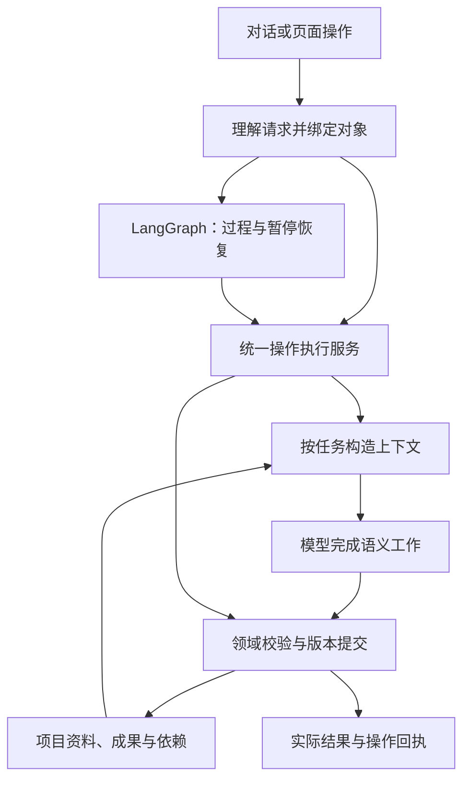
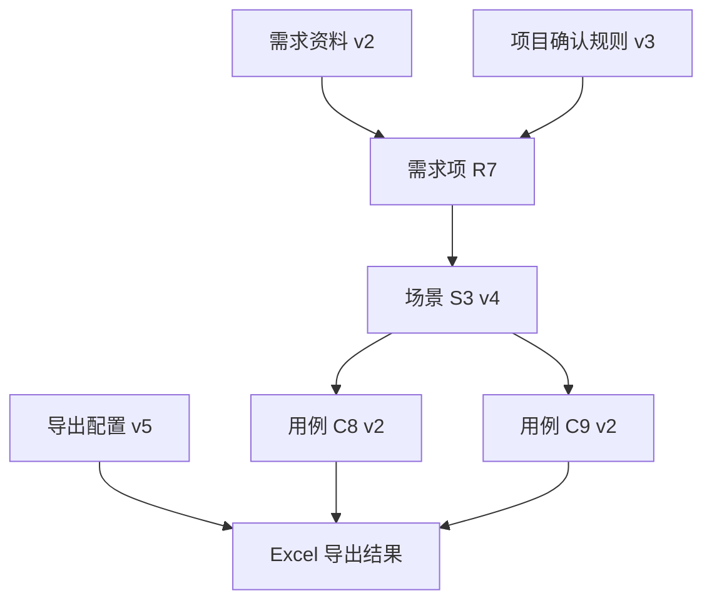

# TCG：以版本化成果为中心的对话协作框架

设计日期：2026-09-11。依据：本轮完整需求、v2.6.0 源码只读核对及 LangGraph 官方文档。本文件提出目标架构和渐进收敛路线，不代表这些约束已经全部实现或验证。本轮不修改应用代码。

## 1. 从业务共性确定系统的中心

你们的共同工作方式是：围绕一个目标，依据资料和已确认知识，形成、检查、修改、确认和交付一组相互关联的成果。需求理解、场景、用例、评审报告是这组成果的不同类型。

推荐把产品定义为“以版本化成果为中心、由证据驱动的人机协作工作空间”。稳定的业务对象使固定流程、自然语言操作、人工编辑和项目协作能够共享规则。

三个变化维度分别处理：

| 变化维度 | 例子 | 稳定承载位置 |
| --- | --- | --- |
| 工作过程 | 生成用例前确认场景；运行中先暂停 | LangGraph 过程和控制策略 |
| 工作内容 | 修改 S3；解释 C17；补充资料；估算数量 | 有明确契约的领域能力 |
| 工作依据 | 新资料、已采用假设、新模板、范围变化 | 带版本的资料、知识及配置 |

主流程是一条成熟的成果生产路径；一轮对话可以查看当前成果、提出局部变更、改变后续工作目标或调用这条路径。页面上的按钮与自然语言最终进入同一个操作入口。

## 2. 整体结构：少量模块，共用一个执行协议



这些是单体应用内的职责模块。现有 Python 服务、SQL 存储、前端和模型网关可以承载第一阶段。成果依赖使用普通关系记录即可；部署规模确实增长后再调整存储和工作进程。

统一操作服务按以下顺序执行：解析明确目标 → 固定输入版本 → 组装上下文 → 运行能力 → 校验 → 按已有授权提交 → 返回实际结果。模型能力与确定性计算共享这个入口，确定性计算可以跳过模型。

## 3. 最小领域模型

| 对象 | 最小内容与意义 |
| --- | --- |
| Project / Workspace | 共享资料、有效项目知识、成果、Profile 的资源边界；聊天保存各自的关注对象和交互历史 |
| Goal | 希望交付的成果、范围、约束、人工确认规则、停止条件，例如“生成登录场景，在生成用例前等待” |
| Evidence | 原始资料或已确认结论；包含不可变版本、可定位片段、用途、适用范围、确认状态和取代关系 |
| Artifact | 稳定身份、不可变版本、类型化业务内容、来源、依赖；场景和用例继续保留各自严格 schema |
| Capability | 领域能力的输入、目标类型、效果、前置条件、上下文要求、执行函数和校验函数 |
| ChangeSet | 针对明确基线版本的增改删，以及依据、影响范围、受保护字段和校验结果 |
| Receipt / Decision | 命令实际完成的结果；采用答案或确认操作所针对的对象、版本、用户和时间 |

这些概念不必一一变成新服务或新表。Run、Turn 和 Pending 是执行及交互记录，与业务成果分开。

成果统一身份和版本协议，业务结构仍有类型。需求项保留规则与来源；场景保留需求关联；用例保留 scenario_id、steps、expected 和自定义字段。业务图和覆盖图可以由结构化成果计算得到。用户编辑图形时，也必须转换成合法的业务修改。

## 4. 两种图分别解决顺序与联动

**过程图回答“下一步允许做什么”。** LangGraph 保留理解需求、澄清、确认理解、生成场景、确认场景、生成用例、评审和交付的标准路径。人工模式、自动模式及停止位置由策略决定。

**成果依赖图回答“改了哪里，什么可能需要更新”。** 它记录具体版本与条目之间的来源、派生、格式约束关系。



修改 S3 时先产生新版本，再依据关系评估 C8、C9 的影响。未关联条目继续保留。修改 Excel 列顺序主要影响导出；修改业务超时规则可能影响需求、场景和用例。关系类型决定失效范围。

依赖信息可以支持 current、needs_review、stale 三类状态。旧版本继续保持原含义，新资料不会悄悄改写历史。初期按成果或条目保守判断；在确有收益时增加更细的字段依赖。

已有引用能找出已知依赖。新增规则或全局约束还需要通过适用范围、需求目录和语义检索发现潜在影响，不能把“旧引用未命中”当作“没有影响”。

## 5. LangGraph 的具体职责

推荐在同一应用内使用两个有不同生命周期的执行图，共享一个操作执行服务和领域存储：

- 主流程图：一个 Run 使用稳定 thread_id，保存长期任务的当前位置、待确认节点、goal_ref 及其版本、成果引用。Goal 与当前有效控制策略由业务库权威持有，执行前按引用核对；checkpoint 中的快照不能覆盖已更新的控制策略。
- 对话执行图：一个 Turn 使用独立 thread_id，可以包含少量操作，执行“理解 → 绑定 → 执行 → 检查结果 → 回复”；需要补问或预览确认时可以持久化等待。后续消息通过明确 pending_id 找到该等待项。

对话执行图控制本轮操作的完成；主流程图控制生成阶段的推进。例如主流程等待场景确认时，一轮“估算数量”完成后，主流程仍等待场景确认。对话图只有调用受控的 continue / pause / change_scope 等能力时，才改变主流程。

当前已有对话 Controller 可作为迁移起点；把其执行状态逐步交给一个持久化执行路径。避免同时保留两套负责同一 Turn 的重试、恢复和完成判断。Run 和 Turn 的执行进度由各自图负责，旧 Controller 只接收请求、关联上下文和读取投影；业务副作用是否已完成以命令回执为准。短小确定性操作可以直接通过共享执行服务返回，但仍使用相同的命令登记和幂等回执协议。

模型可选择注册能力并提出参数、顺序和约束。程序验证目标和前置条件，决定实际调度；模型不直接写 graph state、选择任意 goto 或修改数据库。

这与 LangGraph 对预定 workflow 和动态 agent 路径的区分相符，两类组织方式可以围绕同一组能力组合。[官方说明](https://docs.langchain.com/oss/python/langgraph/workflows-agents)

**三个状态边界必须清晰：**

| 状态 | 保存什么 | 用于什么 |
| --- | --- | --- |
| 图的 checkpoint | run/turn ID、节点、绑定操作、pending ID、结果引用和执行进度 | 暂停、恢复和重试 |
| 业务存储 | 成果版本、项目知识、资料、依赖、配置、命令回执、有效停止约束 | 业务事实和共享访问 |
| 本次模型上下文 | 当前操作实际需要的数据、资料片段和约束 | 单次模型推理 |

Graph runtime context 注入服务、身份、模型适配器等运行依赖；模型使用的 ContextPack 由专门服务构造。运行依赖与 graph state 的区分是 LangGraph 提供的机制。[Graph API](https://docs.langchain.com/oss/python/langgraph/graph-api)

Checkpoint 管线程内执行状态，跨线程项目知识存入应用持久化存储；可以使用既有业务库，无须强制迁移全部数据到 LangGraph Store。[持久化边界](https://docs.langchain.com/oss/python/langgraph/persistence)

恢复 interrupt 时，所在节点会从头执行，因此节点中的外部写入必须可幂等重放。成果提交以 command_id / operation_id 为键保存回执，恢复后先读取已有回执。checkpoint 与业务事务之间的崩溃窗口由该回执弥合。[interrupt 恢复规则](https://docs.langchain.com/oss/python/langgraph/interrupts)

## 6. 灵活性来自能力契约与短反馈循环

一个能力声明如下，具体实现可用 Pydantic 或 dataclass：

```text
Capability
  name, version, description
  target_types, input_schema, result_schema
  effect: read | propose | commit | control
  preconditions, scope_rules
  context_policy
  execute, validate
```

副作用类型由服务端能力定义。“评审并输出意见”与“评审后直接优化”分别声明其效果，中央调度器无需根据某个具体能力名称猜测。

绑定后的操作包含 command_id、用户指令、实际 artifact_id/revision/item_ids、范围、依赖版本和控制约束。展示中的“第三条”先转换为当前视图对应的稳定 ID；数据库确认存在和作用域后才执行。目录未显示全部对象时须标记 partial，并提供按需展开查询。

一轮请求可以形成短小操作序列。例如“先解释第三条，再补一个异常场景，先别生成用例”，包含读取解释、提出场景变更，并约束本轮不调用用例生成。只有用户明确要求暂停或修改当前主任务的停止位置时，才写入 Run 控制策略。每步根据真实执行结果确定后续输入，前一步失败不假装整个请求完成。

程序可验证已注册能力、类型、ID 和范围；语义是否准确仍需模型推理与必要澄清。多义目标只问缺失的对象或范围。“可以”依据回复所指对象或上一条实际确认提问绑定明确 pending；页面上仍有旧待办并不足以授权推进。估算或解释后的普通肯定不能因此推进后台确认节点。若存在两个同等可能的待确认对象，就不能任意选择。

建议设置可配置的操作步数、模型调用次数、总 Token、总时长和修复次数预算。达到边界时交付已经完成的结果并说明剩余工作。简单操作不额外安排规划、反思和总结模型调用；组合操作只在真正需要结果反馈时追加判断。

**开放分析承接新问法。** “用业务语言解释”“为领导总结”“比较两版的风险”可以由同一个只读分析能力接收不同目标。估算、覆盖等要求稳定结构或确定性口径的任务使用专门能力。新写入类型需要真实的执行和校验能力；界面只展示实际保存、实际导出的结果。

## 7. 模型承担哪些工作

| 工作 | 主要承担者 | 说明 |
| --- | --- | --- |
| 理解口语、指代、多个动作和限制 | 模型提出，程序绑定 | 参数必须落到实际对象 |
| 提取需求、识别冲突、给建议假设 | 模型 | 带来源和不确定性，假设等待采用 |
| 生成场景、用例和局部修改建议 | 模型 | 输出类型化结果或 ChangeSet |
| 判断业务充分性和新增规则影响 | 模型配合索引 | 明确检查范围和证据缺口 |
| 解释、总结、估算范围 | 模型 | 已有数量与汇总由程序计算 |
| ID、版本、权限、引用合法性、流程前置条件 | 程序 | 不依靠提示词约束来保证 |
| 导出、结构覆盖统计、原子提交、幂等回执 | 程序 | 可重复核验的确定性工作 |

建议答案即使每题都有，也需要区分“原文支持的建议”和“等待确认的假设”。依据不足时给出明确的候选假设及适用条件，不能伪装成资料事实。点击采用先填入逐题草稿并移除该题的待答提示，草稿仍可修改；提交澄清后才形成已确认记录。

## 8. 上下文是一份按任务构建的输入契约

每个能力声明 ContextPolicy，由同一个 ContextService 执行：先解析依赖，再选取资料，最后进行预算准入并记录实际输入。

| 操作 | 需要带入 | 结果范围 |
| --- | --- | --- |
| 识别本轮请求 | 当前关注对象、待确认项、紧凑目录、近期对话、能力说明 | 下一步操作候选 |
| 按场景估算用例 | 指定场景、测试类型和深度、用户约束 | 逐场景数量区间、假设和合计 |
| 解释某用例 | 该用例、关联场景与需求、适用规则、支持原文 | 对指定版本的解释 |
| 修改场景并同步 | 目标场景、相关用例、上游规则、受保护字段 | 局部联合 ChangeSet |
| 新资料影响分析 | 新旧资料差异、反向依赖、适用范围内需求目录、补充检索 | 明确影响和待核查候选 |
| 总结大量用例 | 程序统计、分组内容或摘要、需要解释的细节 | 明确覆盖范围的总结 |
| 学习或应用模板 | 目标类型、模板定义、格式样例、相关 Profile 字段 | 独立的场景或用例配置变更 |

解释已保存用例默认依据其历史版本；如果用户要求“根据最新需求检查”，才切换到当前资料并进行对比。两种操作在上下文和结果中明确区分。

ContextPack 至少记录：

```text
operation + instruction + constraints
target_refs + dependency_manifest
applicable_rules + exact_evidence_spans
profile_projection + output_schema
coverage: requested / included / omitted / unresolved
budget: count_method / input_tokens / output_allowance / margin
```

依赖清单固定所用成果、资料、已确认知识和配置版本。原文片段包含准确定位和用途；摘要保留支持引用，不能冒充原始证据。模板样例只进入格式上下文，不能成为需求规则或合法业务引用。资料和聊天自由文本不具备改写系统能力权限或输出契约的权力。

相关片段优先来自明确引用及父级关系，再用检索补足。适用的全局约束、定义、例外和已确认规则是必要依赖。固定 top-k 检索不足以承诺整个需求范围完整覆盖。

**完整请求准入：**

```text
最终请求输入 Token + 实际生效的输出上限 + 安全余量
≤ 当前模型可用上下文窗口
```

计数对象包括系统提示、能力说明、schema、模板规则、历史摘录、资料及修复提示。记录精确计数或估算所用方法；模型响应的真实 usage 另行记录。模型容量未知时须补齐配置或使用部署时明确选定的保守配置，不能把 0 解释成无限容量。输出预留必须与网关实际发送或服务端强制执行的输出上限一致。

超限依次处理：移除可选对话与格式样例；对可独立完成的业务条目分批并保留其必要依据；必要时使用有来源的规则投影。若单条工作的必要依赖仍无法装入，明确容量缺口或返回标明范围的部分结果，不静默截断关键证据。

## 9. 大文档第一次完整处理，后续按依赖复用

资料按源版本解析，保留章节、表格、块和定位。全量理解任务在预算允许时单批处理，超过预算时按结构分组，建立章节处理清单、需求项和规则索引。

跨章节定义、角色、例外、冲突通过一次有明确范围的归并解决；归并输入也服从预算，不能把全部报告永久复制成每轮的“全局上下文”。全局索引保持紧凑，存储规则 ID、适用范围、关联和来源，需要时再展开正文。

后续生成、评审、问答和修改共享这套资料索引，但按自己的上下文契约读取。新版本资料复用未变部分，对变更部分重新提取，再处理受影响关系。

缓存键来自实际消费的依赖清单以及能力、提示词、schema、上下文策略、模型配置版本。改变需求范围或分析规则必须使相关理解缓存失效；只调整导出列顺序不必让需求理解重新执行。第一阶段可以整份配置版本失效，先保证正确，再细化复用范围。

“所有章节处理过”“所有需求有场景”“所有场景有用例”“业务语义充分”是四个不同结论。前三者可核验结构和处理记录，第四者仍需业务检查；页面不能用一个 100% 数值混合表达。

## 10. 修改、确认和运行中插话使用同一提交纪律

读取指定快照不占写锁，运行状态变化也不抹去一次合法的历史解释。结果注明所读版本即可。

写入过程分为计算和提交。模型在数据库事务外形成 ChangeSet；提交使用短事务检查目标与依赖版本、有效命令、写入范围、受保护人工字段和控制策略，再保存新版本、依赖及幂等回执。

已有授权足够时直接提交；“先给我看差异”则保存 proposal 等待采用。预览确认绑定 proposal_id 和基线版本；采用不会先重新生成一份不同内容。工作流确认另绑定 run_id、interrupt_id、artifact_id/revision 和 control_version；等待期间修改成果后更新待确认引用，使旧确认凭据失效。预览保存自身记录，不改变业务成果头版本。

修改场景并同步用例时，下游建议基于同一份新场景草稿生成。可以一次提交的小范围修改使用一个 ChangeSet。长期批量同步则记录每批成功和未完成项，未更新的下游明确标记过期；不把部分完成显示成全部成功。

主流程正在计算时收到修改请求，在安全步骤边界协调；已运行的旧输入模型调用即使返回，也须通过版本与控制检查才可发布。原本等待人工确认的 Run 修改后继续等待；原本运行中的 Run 才能在已有授权和最新停止策略允许时自动恢复。

“暂停”“不生成用例”属于控制版本；新增资料和修改业务规则属于输入版本。控制变化不会天然使旧需求理解缓存失效。用户停止后，已排队的旧继续请求不得重新推进流程。

Graph checkpoint 恢复、业务成果撤销和会话历史回放分别定义：恢复运行不能自动撤销数据库中的业务提交；业务撤销应产生可追踪的新版本。

## 11. 项目知识、模板和展示如何自然落入框架

项目共享的是已确认、声明适用范围的知识。点击采用、提交澄清、项目共享分别记录：采用只更新逐题草稿；提交将答案保存为已确认知识；共享按项目默认策略或用户明确要求发布有效规则。用户已要求同项目复用，因此可将已提交澄清默认设为项目范围，并在界面标明适用范围，无须每题反复询问。其他项目成员的任务加载适用规则；个人聊天全文保持会话边界。访问范围由服务端检查。

Profile 保存场景与用例各自的字段、导出映射、生成深度和写作要求。sample case 建议由 Profile 引用带版本的格式样例库；只在生成、修改或模板学习需要时带入。这样样例可复用、可更换，其业务内容不会污染当前需求。

操作返回统一的展示内容类型，例如 answer、artifact_ref、diff、pending、coverage、download、estimate。评审结果引用具体 case，并直接展示步骤、预期、问题与修改建议。采用后 pending 从待办区消失，历史操作仍可展开查看。

界面初始输入框保持紧凑；结果区域获得主要宽度。快捷任务填入具体可编辑提示词；自然语言仍使用同一后端。页面展示“已修改”“已导出”必须基于回执和真实文件。

## 12. 一段连续对话验证框架

前提：项目已有需求理解、场景及一部分用例，主流程处于人工确认节点。

| 用户对话 | 后台动作 | 应有结果 |
| --- | --- | --- |
| “估算这些场景需要多少用例，先不要生成。” | 绑定场景版本，读取测试深度，执行只读估算；禁止本轮调用生成 | 数量区间与依据；没有新增用例；主流程原有状态不变 |
| “第三条为什么有这么多？” | 绑定上次估算的第三个场景和估算条目 | 解释该条估算；不重读全部文档 |
| “锁定规则采用第二个建议。” | 绑定具体问题及候选，写入逐题草稿 | 该题待答提示消失；仍可修改，尚未成为项目事实 |
| “提交这些澄清，同项目都按这个。” | 校验问题集版本，保存已确认答案并按项目范围共享 | 同项目后续任务可复用；保存来源、确认人与适用范围 |
| “按这个规则改第三个场景，相关用例一起改，先看差异。” | 计算影响，用新场景草稿生成关联用例修改 | 联合差异；没有改动正式成果版本 |
| “可以，应用修改，但先别继续。” | 校验明确 proposal 的基线，幂等提交；保留停止约束 | 新场景与用例版本；主流程仍暂停 |
| “补充这个新文档，看看还影响哪些地方。” | 新资料入库，对差异和适用范围做影响分析 | 已知影响、待核查候选、检索范围；无静默全量重跑 |
| “把需要修改的补好，再告诉我覆盖缺口。” | 定向更新；结构统计及必要业务评估 | 需求→场景、场景→用例覆盖分开；过期项可见 |
| “给领导总结这批用例，导出场景和用例。” | 读取当前成果做总结，按对应模板实际导出 | 易读总结、两类真实下载文件及版本信息 |

“第三条”“这个规则”“可以”分别绑定历史焦点、明确采用对象，以及回复所指或上一条确认提问中的提案。如果引用已含糊，系统只补问缺失对象。

## 13. v2.6.0 的基础与需要收敛的差距

已存在的能力注册、对话入口、版本检查、修改预览、回执、停止约束、澄清草稿及实际展示契约可以保留。源码中的估算已接近按任务提供局部上下文的正确模式。

本次只读核对发现以下具体差距：

| 位置 | 现状 | 收敛方向 |
| --- | --- | --- |
| conversation.py 的 TURN_PROMPT 与执行分支 | 中央提示逐项列功能，且包含特定 review optimize 的效果判断 | 能力声明效果、前置条件和说明；中央只保留通用协议 |
| conversation_context.py | 对象解析依赖能力名；部分 source 截断未声明 partial | 类型适配器与完整存储解析；所有缩略目录标明范围 |
| workflow.py 的 dispatch | query、modify、learn_template 仍有历史主图入口 | 新工作统一走能力服务，旧线程按版本兼容 |
| workflow.py 的 save_report 等 | 有直接更新既有 revision payload 的路径 | 业务版本不可变；附加报告新建版本或独立关联记录 |
| artifact_actions.py 的 local_evidence | 直接引用外还附加大量变更/澄清，父级与全局规则未统一解析 | 依赖闭包加任务检索，统一 ContextService |
| flow.py / workflow.py | 重复的 global_requirement_map 可能包含完整报告和全部规则 | 紧凑规则索引及适用投影，重复基础也须预算检查 |
| direct.py / model.py | 容量 0 可视为可放入；预留输出与实际传输上限不总一致 | 完整请求准入及供应方适配契约 |
| workflow.py 的理解复用签名 | 来源 ID 和角色相同可复用，但 scope、additional_rules 会改变理解输入 | 按实际依赖与策略版本判断复用 |

这些事实说明应继续统一内部约束，不能仅凭入口统一就宣称架构已经完成。当前回执和版本保护是有用基础；上述缺口也不意味着所有缓存或所有对话都失效。

## 14. 实施顺序与架构验收

1. 先统一 BoundOperation、Outcome、ChangeSet 和提交协议，让现有固定节点、聊天与人工编辑共用。保留已有核心节点语义，同时封住直接改写已保存 revision 的路径。
2. 实现唯一的 ContextService 和依赖清单，优先接估算、解释、修改、评审，再替换全量理解和模板学习中的特殊上下文路径。同步收紧预算和缓存键。
3. 完善成果不可变版本、关系类型和影响状态，接通新增资料、项目规则与上下游定向同步。
4. 将 Turn 的持久化执行收敛到一条 LangGraph 路径，移除新任务的重复调度入口。历史等待线程固定 graph_version，使用兼容路径或显式迁移，不随意改名删除其等待节点。兼容的是节点名称和恢复位置，新旧图的业务写入均须进入统一版本与回执协议。

首次落地继续使用单体服务和已有数据存储。只有明确的并发与部署需求才引入独立任务队列或更换数据库；能力协议与依赖模型先保持稳定。

验收关注以下可观察约束：

- 只读问答与估算不新增或修改业务场景和用例；允许保存分析报告、回执和聊天结果。
- 未被授权继续的流程始终停在指定节点；暂停后的旧继续请求不能抢跑。
- 修改只作用于绑定范围；原始人工字段和不受影响成果保留；旧版本不能覆盖新版本。
- 恢复或重复采用同一操作只产生一次业务提交；上游已变化的预览必须重新核对。
- 每次模型调用可查输入版本、证据范围、预算及实际 usage；超限和覆盖缺口显式呈现。
- 更换一种总结问法无需增加 intent；新增普通能力不要求同时修改主流程、中央解释器和通用提交器。
- 完整连续对话通过真实 HTTP 与 LangGraph 执行验证，并在实际内网模型上检验指代、多动作、否定和中途插话；可控响应测试只证明程序处理，不能替代真实语义验证。

最终设计取舍是：用稳定的成果、依据、能力和提交规则承载业务；LangGraph 组织执行；模型在明确对象和上下文中承担语言与语义工作。新需求优先扩展领域能力，只有业务顺序真正改变时才修改主流程。
