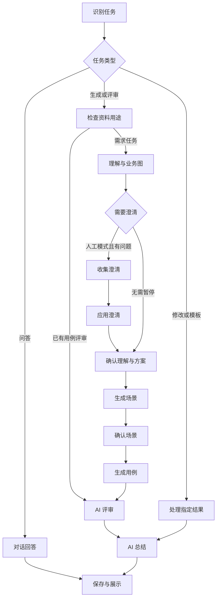

# TCG v2.5 流程重整

## 原问题

1. 不同版本的执行分支叠在一起，自动识别有时直接被改成生成用例。
2. 生成请求因缺少需求返回回答产物，但收尾根据意图硬编码“已生成”，把回答数量当用例数量。
3. 需求分析、保存澄清、多轮追问、确认方案放在同一节点，恢复时重复执行副作用。
4. 文件用途选择会残留，学习模板后上传需求也可能仍被指定为 example。
5. 普通提问被当成需求正文；等待人工确认时聊天不可用。

## 唯一的新任务入口

新任务 graph_version=7，由 workflow.py 构建独立 LangGraph。旧任务保留旧图，不改变旧检查点含义。数据库、模型连接、上传解析、Profile、Excel、Artifact 版本管理沿用既有模块。

分析需求可在理解后结束；仅生成场景可在场景阶段结束。Auto 自动通过业务确认节点；缺少需求是输入问题，即使 Auto 也等待补充，不伪装完成。HITP 在独立澄清节点、方案节点和场景节点暂停。

## 节点职责

| 节点 | 输入与输出 | 恢复规则 |
|---|---|---|
| dispatch | 用户消息、已选目标 → intent | 自动识别真实调用路由，不默认强制生成 |
| inputs | 资料用途 → 可用需求 | 示例需显式勾选本轮作为需求；缺少正文可直接补充 |
| understand | 需求 → 规则、业务图、问题、方案 | 完成产物按固定键复用 |
| clarification_gate | 展示问题 → 用户答案 | 仅暂停和返回答案，无模型调用 |
| apply_answer | 问题和答案 → 更新后的理解 | 来源只写一次，模型修复不重复插入 |
| understanding_gate | 最新理解 → 已确认方案 | 与澄清节点分离，不自动无限追问 |
| scenarios / scenario_gate | 理解 → 场景 → 人工确认 | 编辑最新版本后继续 |
| cases / review | 最新场景或已有用例 → 已评审用例 | 每个阶段独立缓存与校验 |
| conversation | 问题 → 对话回答 | 不生成用例，不伪造业务证据 |
| single | 修改或模板 → 修订版本或配置建议 | 模板不自动保存 Profile |
| summarize / publish | 实际产物 → AI 总结和展示 | 总结失败保留产物；回答不计为用例 |

## 人机交互

- 文件用途、正文作为需求、MODE 和任务快捷入口常驻输入框附近。
- 选择“证据问答”后，在人工暂停期间发送问题，只追加对话，不调用 resume。
- 澄清阶段直接发送正文表示提交答案；方案和场景确认仍使用明确按钮。
- 通过“让 AI 修改此结果”选择目标，再发送修改要求。
- 从分析结果选择“生成场景”，或从场景结果选择“生成用例”，传递当前产物 ID，避免重复分析。
- 结果面板按需打开；Profile 和 Excel 编辑仍使用现有可视化配置页。

## 恢复与限制

模型契约错误自动带具体错误修复，合法行由程序保留；持续失败仍暂停。已通过阶段不重跑，重试不重新提交上次已消费的 resume。不能保证外部模型永远输出合格内容。

普通 Auto 生成约五个业务模型调用：理解、场景、用例、评审、总结；自动意图识别另一次。澄清后的更新、修复、长输出分页会增加调用。上下文默认不设本地 token 上限，显式设置后才做容量分组；解析及单请求体积保护仍存在。

设计参考 LangGraph 官方中断语义：恢复会重新执行暂停节点，所以将副作用与等待节点分离。
https://docs.langchain.com/oss/python/langgraph/interrupts

## 验证

`python3 -m pytest -q tests/test_workflow_v25.py`：10 项主流程模拟测试通过，涵盖 Auto、HITP、修改场景、Excel/Profile、单独评审、澄清失败重试、截图中的示例来源确认、无资料对话、暂停时提问、场景续接、模板建议及局部修改、进程重启恢复（部分在同一用例中组合验证）。

前端 `workspace-smoke.test.tsx`：2 项组件冒烟通过；TypeScript/Vite 生产构建通过。未运行全量历史回归，未验证实际内网模型、超大文档语义质量或真实浏览器视觉表现。不能用模拟测试结果承诺所有真实需求都能成功。
