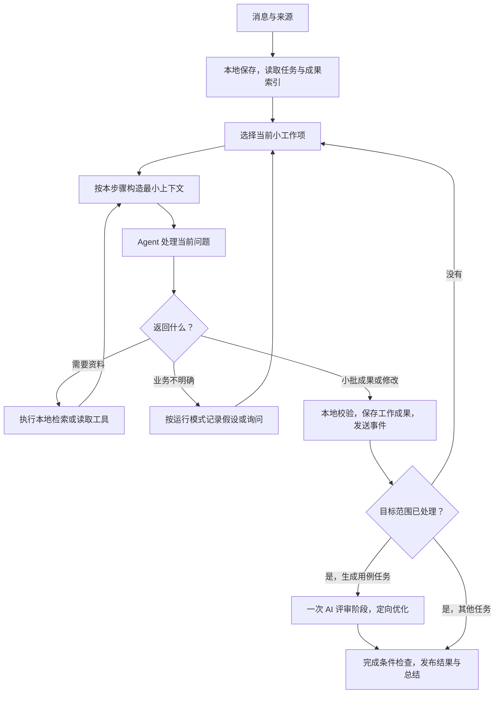

# TCG 本地 Agent 执行重设计

日期：2026-09-08。状态：设计提案，未实现。本文不表示运行代码已经修复或真实性能已经达标。

## 1. 目标与依据

用户需要一个能持续推进的测试设计助手：聊天输入、资料按需查阅、过程可核查、尽早看到业务理解和成果、局部修改、出错后保留进度。Python、LangGraph、LangChain、本地文件和 SQLite 继续使用；保留现有模型设置、`.env`、自定义 Header、内网 minimal Chat Completions 接入和 60 分钟请求超时。

依据：

- 原始 `TCG_Case_Agent_PRD_v1.0_zh-CN.docx`，重点为第 3、6、8、9、11、12、14、18、19 节。
- 用户后续明确要求：展示执行过程及发送内容；SSE；简化界面；业务图可查看；允许按当前信息继续；大文档只发送当前需要的内容。
- 本次提供的诊断 `run_fffb33b5cc434382b5e6c5230c0dd5f3`。
- GitHub PR #5：合并提交 `973f555f7fe33fcb23465ce2a4897ef6cd8f4c74`；本地相同代码树 `aa9c5744483f84b3b1df0663cc00e487a017b344`。
- 当前代码的两次受控运行，使用真实 FastAPI、LangGraph、SQLite 和测试模型；没有访问内网模型。

后续用户要求优先于原 PRD 的界面约束：Auto 也可显示进度、来源和可展开的阶段成果，但显示不代表必须暂停确认。原 PRD 的固定一次 AI Review & Optimize、可追溯、版本化、不得静默截断用例数量仍保留。

## 2. 本次失败的证据

日志发生于 2026-09-08 10:35:13 至 10:40:06 UTC，即北京时间 18:35 至 18:40。总运行 292.313 秒。

| 调用 | 耗时 | 完整提示词字符 | 上游报告输入 Token | 上游报告输出 Token |
| --- | ---: | ---: | ---: | ---: |
| route | 6.588 秒 | 1,746 | 371 | 272 |
| agent_plan | 34.750 秒 | 20,648 | 7,696 | 2,771 |
| agent_analyze | 104.437 秒 | 21,406 | 7,841 | 9,225 |
| agent_analyze:schema_repair | 146.241 秒 | 27,709 | 10,905 | 12,408 |
| 合计 | 292.016 秒 | 71,509 | 26,813 | 24,676 |

三次主要调用都带有 72 个证据段落。原分析返回 10 条，整份 schema 重写返回 24 条。最后失败于本地 `preserve_schema_repair`，约束为 `same_schema_repair_item_count`。四次模型调用均返回并完成 JSON 解析；这份日志没有显示鉴权失败或上游请求超时。

不能从这份仅含元数据的日志恢复首次触发重写的原始字段错误。`actual: missing` 也是应用错误描述，不能据此认定上游没有返回 items。输出 Token 采用上游 usage 原值，不能等同于界面可见文字长度。

这段日志早于 PR #5 的合并时间 12:09:29 UTC。当前主分支已经改为 `:field_repair:` 和有界文档分析，错误标识也已变化，因此它反映旧执行路径；不能据此认定 PR #5 部署后仍发生同一错误，也不能仅靠更新承诺解决全部性能问题。

## 3. 当前主分支仍存在的问题

| 问题 | 代码或运行证据 | 影响 |
| --- | --- | --- |
| 简单任务也反复请求规划 | `agent.py:plan`；受控简单生成共 8 次调用，其中 4 次 `agent_plan` | 每个小动作后多一次模型等待，还反复输出整套计划 |
| 全量分析形成前置关卡 | `agent_analysis.py:analyze_documents` 遍历全部批次并整合后，`work` 才产生 analysis artifact | 单次输入变小了，但首个可用成果仍可能很晚 |
| Auto 的业务问题仍会暂停 | `gate` 以 `questions or confirm_strategy` 决定暂停；受控 `mode=auto, confirm_strategy=False` 返回 waiting/clarification | 自动推进与用户预期不一致 |
| 补充规则导致范围过大的失效 | `plan` 在 instruction epoch 改变时清空本轮 analysis/scenario/cases 引用 | 局部改动可能触发整轮重新分析和生成；历史成果虽未删除，也没有被有效复用 |
| 生成后没有固定语义评审 | 受控调用为 plan、analyze、plan、scenarios、plan、cases、plan、summary，没有 review | 本地关联覆盖被用作完成依据，与 PRD 的 AI Review & Optimize 不一致 |
| 输出仍承担过多职责 | `agent_analyze` 同时要求需求、问题、假设、业务图、策略和段落归类 | 输出长，字段多，一处问题就进入修正链 |
| 工具交互仍很重 | 文档读取回到完整 `agent_plan`，每轮最多 4 次工具动作 | 小查询需要多轮规划；硬次数又可能限制必要补读 |
| 版本诊断不够明确 | health 和 diagnostics 都固定写 `2.1.0` | 无法直接识别本机是否仍运行旧进程、旧代码或旧图版本 |

受控正常生成的调用序列：

```text
agent_plan → agent_analyze → agent_plan → agent_scenarios
→ agent_plan → agent_cases → agent_plan → agent_summary
```

这些探针证明调度行为，不证明真实模型的业务质量或最终耗时。已有测试中甚至明确断言 Auto 遇到问题应暂停；重构时必须修订此类与需求冲突的预期，不能用旧测试通过代替产品验收。

## 4. 方案选择

| 方案 | 收益 | 局限 |
| --- | --- | --- |
| 继续缩小字符预算、调整重试次数 | 改动小 | 保留全量分析关卡、反复规划和巨大结果合同 |
| 完全开放聊天 Agent，自由阅读和结束 | 灵活 | 容易漏范围、重复搜索，难保证一次评审、引用和成果版本 |
| 小工作项驱动的受控 Agent，按需查阅并增量提交 | 同时减少请求负担、支持局部恢复和覆盖核查 | 需要调整调度、状态、上下文和成果写入边界 |

采用第三种。智能体决定业务拆分、检索问题、测试方法和变更内容；程序处理已确定的依赖、批次推进、事务和完成条件。正常分页或已知后继步骤不额外调用一个全局规划模型。

## 5. 执行循环



LangGraph 管理循环、等待和恢复，不再让一个 `work` 调用暗中完成全部文档和全部生成分页。每个工作项有独立持久化边界；较大的任务在多个工作项中推进。

### 5.1 工作项与状态

State 只保留 run_id、scope_revision、profile_snapshot_id、current_work_id、artifact revision 引用、pending queue cursor、waiting reason 和 instruction version。

SQLite 增加工作项、事实、依赖、段落处理清单和阶段成果引用。工作项保存 kind、target_ids、source revisions、dependency revisions、状态、attempt、last_progress、idempotency_key、accepted_patch_revision 和 error。

工作项类型包括：理解某章节、补查某规则、构建某业务子图、设计一组场景、生成一组用例、评审一组用例、修正某字段、回答问题、修改选定条目。正常状态为 queued → running → completed；失败项可为 retryable_failed，输入不足为 waiting_input，版本改变为 invalidated。

每次被接受的结果和工作项状态、事件在同一事务写入。服务重启后只重放未完成项；用 idempotency_key 阻止重复写入。模型在进程中途返回的旧结果必须与输入 revision 再核对。

### 5.2 模型调用边界

- 显式目标、确认、继续、暂停、导出、分页等已知控制动作由本地处理。
- 自然语言有歧义或需要重新选择业务工作时，才调用规划能力。首次规划与任务识别合并，不再串行 route 加完整 plan。
- 一次正常业务调用同时返回简短进度结论和工作成果，不另发总结请求复述同一结果。
- 模型可以返回需要的资料，工具完成后在同一工作项内继续；不回到全局规划重写整份计划。
- 查询直接产出有依据的回答；只有无关范围、缺资料或歧义需要继续查阅。
- 源文档与工具结果都是数据，不能改变动作权限或执行系统指令。

### 5.3 有界响应协议

响应使用判别字段 `kind`：`need_context`、`patch`、`clarify`、`answer`。根据当前能力仅提供必要的 schema。

- `need_context`：工具名称、明确 query/section/refs、读取理由、分页游标。一次最多 4 个有界的只读工具请求；这是单批大小，可以继续下一批。
- `patch`：当前工作项的原子事实、业务图增量或 artifact operations，以及简短 summary 和 continuation。一次建议 1–5 条 case 或一个小规则组，不限制总条数。
- `clarify`：问题、受影响范围、是否存在可继续的显式假设或参数化表达；不能自己把不明事实写成确定需求。
- `answer`：回答和引用，证据不足时明确说明。

永久 ID 由服务端分配。模型新增图节点用本批局部别名，服务端统一解析边和引用；更新操作使用已有稳定 ID 和 expected_revision。JSON 合法不代表语义正确，引用和业务检查仍执行。

## 6. 文档访问与上下文

### 6.1 本地资源工具

复用现有文档解析和引用；增加按标题、章节、表格范围、词项和关联成果访问的接口。工具包括 list_sections、search_evidence、read_evidence、get_facts、get_dependencies、get_artifact_items、get_profile_fields、get_coverage_gaps。

所有工具都有授权来源范围、结果预算、游标与 omitted_count。不能把搜索前几条视为已处理整份需求。无匹配时允许换词、按标题导航或按段落分页浏览。

搜索从现有本地词项检索开始，可使用 SQLite 索引，中文保留分词/二元词支持；不要求外部向量服务或 Embedding API。

### 6.2 每种调用实际携带什么

| 调用 | 携带 | 留在本地 |
| --- | --- | --- |
| 选择工作 | 当前目标、简短已确认决策、模块与成果计数、待办和阻塞原因 | 原文、完整成果、整段历史对话 |
| 局部需求理解 | 当前章节、涉及的已确认规则和冲突、待解决问题 | 其他正文、全部 case |
| 场景设计 | 当前规则组、相关分支、适用测试方法和 schema | 全文、其他模块细节、历史全部场景 |
| 用例生成 | 当前场景、必要规则、相关证据、case schema/type/level | 全文、完整策略报告、无关场景、全部历史 case |
| AI 评审 | 当前 case 组、关联规则、评审规则、全局重复/覆盖候选摘要 | 无关 case 正文、全文 |
| 定向修改 | 选定条目、用户修改要求、受影响字段约束、相关证据 | 其他无关条目 |
| 局部修正 | 原始错误路径、错误值、必要合同及相关引用 | 全部原始模型输出、全套 artifact |
| 最终汇总 | 已保存数量、变更、风险、未决事项 | 不另调模型；复用业务调用生成的结论 |

规划建议预算 1,000–2,000 输入 Token；业务小工作项 2,000–6,000；单次只读工具正文约 1,000–2,000。它们是待实测调整的初始配置，不是已实现的性能指标。预算必须包含系统指令、工具合同和输出预留。

已知模型使用本地适配 tokenizer；未知网关使用明确标记的保守估计，同时记录真实字符和供应商 usage。超预算就拆工作项或补读，不截断业务规则、不把估计 Token 当实际计费。

返回给模型的来源定位采用短引用和共享来源字典，避免每段重复发送长 ID、文件名等元数据。最终成果仍保存完整可追溯引用。

### 6.3 长文档完整性与尽早展示

1. 本地建立完整章节目录、来源角色和段落处理清单；这一步不声称完成语义理解。
2. 先处理用户指定模块或核心流程，尽早显示该部分的业务理解、子图及范围标识。
3. 当前局部规则足够时，可以生成场景和 case 工作草稿；相关依赖未核查时明确标记待评审。
4. 范围内其他章节仍在队列中。每段有 reviewed、context-only、uncertain 或 excluded-with-reason 记录。
5. 新发现跨模块规则时，更新依赖并使受影响草稿失效，局部修订。未受影响工作不重跑。
6. 发布完整目标前检查目录清单、依赖、需求/分支/类型覆盖与评审状态，不能漏尾部段落或只处理热门搜索结果。

完整覆盖整个大文档本身需要读取足够内容，不能承诺完全不读全文。优化的是不反复发送全文，以及不等所有章节都结束才展示第一部分成果。只有用户明确缩小目标范围，才可排除其他章节，并把范围变化写入结果。

### 6.4 缓存与多轮增量

解析缓存键包含源文件 hash、解析器版本。业务结果键包含授权项目、来源/依赖 revision、当前能力与 prompt/schema 版本、模型配置、实际相关 Profile 字段、适用用户规则和目标范围。

缓存不得只按文本相似度或聊天 ID 命中。权限、业务输入或依赖变化必须失效。无关聊天语句、展示开关、控制命令不能使全部业务缓存失效。

确认信息以结构化事实与引用保存；长期记忆全文留在本地，根据当前工作项检索。比如“锁定 4 次改成 5 次”应定位锁定规则、相关图边及场景/case，其他模块 revision 不变；没有足够依赖信息时先执行影响分析，不能猜测没有影响。

## 7. 人机协作与流程收敛

Auto 与需要确认分开；测试深度与运行模式也分开。界面默认折叠配置，保留明确的自动推进/关键处确认入口；深度 Auto/Quick/Standard/Deep 在可展开设置中。

- Auto：有有效业务来源时，非致命不明确项以 assumption、参数化测试或未决规则记录，继续可执行工作；不得无依据补造确定数值。
- 关键处确认：只在用户要求的方向确认、重大无法解开的范围歧义和场景评审处等待。无影响的小问题不反复提问。
- “就这样继续”：记录对当前未决事项的继续决定，不重新做已完成分析；业务事实仍保持未确认标识。
- “修改规则后继续”：先保存明确修改，更新受影响依赖，再沿用继续决定；不因为修订再次问同一问题。
- 没有有效业务来源、明确要求有证据的问答却无证据、认证/网络故障，不能靠假设伪装成成功。返回可操作的不足/错误说明。
- 暂停保留工作项与检查点；继续恢复。暂停与取消必须使用不同操作，取消仍遵循原有工作区清理和审计语义。

不把每次检索都算作全局规划轮数。对相同工具参数与相同资料 revision 记录结果指纹，重复无新信息时要求换检索或明确不足；对同一字段/缺口设置有限修正次数。预算耗尽明确暂停/失败且保留进度，不静默宣称完成，不把预算当用例总数上限。

## 8. 校验、评审与发布

本地校验与语义评审分开。

- 本地负责字段类型、稳定 ID、引用权限、revision 冲突、关系完整性、重复候选和 coverage 清单。
- 不改业务含义的包装规范化可在本地完成；无法保证语义不变时禁止自动强制转换。
- 格式失败只修当前工作项中的错误字段。缺少业务证据是补充任务，不是重新生成整份结果的 schema repair。
- 一个有错误的原子 patch 整体不提交，但此前已完成的其他 patch 不撤销。错误 patch 作为失败工作项保存，可独立重试。
- Generate Case 必须经过恰好一个 AI Review & Optimize 工作流阶段。该阶段可按组调用模型，对 case 做 ADD/UPDATE/DELETE；不通过分数触发整套重新生成。
- 评审除字段完整性，还检查可执行步骤、预期结果依据、case type 适用性、重复/冲突和跨模块规则。对全局候选问题定向读取相关组。
- 有部分成功成果时可查看工作草稿，但未完成覆盖与评审不能标为最终完成。用户可以明确改变范围；系统不能自行缩小目标来掩盖失败。
- 不因最终描述文字生成失败而撤销已校验成果；由本地汇总已保存的业务摘要、数量、变化与风险。

## 9. SSE 和界面

使用持久化、有序事件，Last-Event-ID 重连。建议事件包含 run_id、work_id、sequence、status、summary、scope、source refs、elapsed、request/response size 和可选 usage。

主要事件为 work.started、context.selected、tool.started、tool.completed、model.started、model.waiting、model.delta、patch.accepted、work.failed、run.waiting、run.completed。心跳不能冒充有业务进展。

前端默认展示简洁时间线和当前工作：正在读取哪一节、已理解什么、下一步是什么、已有多少工作成果。每条可展开查看来源、实际发送内容、模型返回、修改 diff 和错误；普通界面不铺满原始 JSON。

展示示例，数值仅用于说明界面：

```text
已定位“登录与账户锁定”章节，正在读取相关规则。
已保存 4 条规则和业务子图；注册模块尚未处理。
已生成本组 3 条用例草稿，等待统一评审。
账户锁定时长缺失，按你的继续指令保留为待确认参数。
正在修正第 2 条用例的步骤字段，其他成果已保存。
```

等待必须区分队列、模型响应、工具处理、用户输入和失败。继续保持 60 分钟硬请求超时；较长等待只发可见提示，不自动缩短用户配置。时间线提供暂停、继续、重试当前工作项和调整范围的入口。

上游支持流式响应时透传内容增量；minimal 内网接口只提供完整 JSON 时，显示真实等待与工具/工作项事件，正文返回后展示，不能伪造逐字生成或推测模型内部进度。展示可验证的行动、依据和结论，不展示原始思维链。

## 10. 实施边界与顺序

这是一份重构设计。实施分为可独立核查的三个交付，全部达到验收后再切换默认新任务入口：

1. 恢复产品行为并减少固定开销：Auto 策略、固定一次评审、跳过冗余全局 plan、本地最终汇总、运行构建标识和等待分类。
2. 新增工作项执行器、能力特定小合同、按需工具续接、局部事务和失败恢复。完整分析与生成分页从大节点内迁到持久工作队列。
3. 引入章节/事实/依赖索引和跨轮失效；界面展示分批成果、来源核查与变更；验证长文档全范围处理和真实网关表现。

新任务使用明确的新 graph/protocol 版本。旧任务保留原解释器，升级不改写旧检查点。提供从旧成果创建新任务的显式入口；不能把旧 graph 状态直接交给新 schema。

数据迁移为追加表/字段；既有 source、profile、artifact 和 revision 不破坏。服务启动记录加载时 commit、graph/protocol/schema/prompt 版本、启动时间和资源配置；诊断导出记录同样信息，避免只看到 2.1.0。读取运行中加载的版本，而不是仅查询磁盘上后来被更新的 HEAD。

内网适配继续通过既有模型适配器，不要求 function calling、Responses API、/models 或新请求参数。若模型只支持普通 JSON，即由应用解释有界行动响应并执行本地工具。

并发默认每个模型 1 个请求；通过配置和实际网关评估后可提高到 2 个独立工作项。依赖写入和 revision 校验串行，不能靠无限并行制造网关排队或重复开销。

## 11. 验收与测量

| 验收项 | 标准 |
| --- | --- |
| 当前旧错误回归 | 10 条结果中的一个字段错误，只修该字段，不整套重写；合法 ID 与其他条目保持不变 |
| 简单正常生成 | 单模块、单输入批、单场景批、单 case 批、无补读/修正的受控流程，模型调用不超过 5 次且包含一次 AI 评审；不调用独立最终总结 |
| 简单问答 | 已有相关来源且无需追加检索的受控问题，1–2 次模型调用，不生成测试策略 |
| Auto | 非致命业务问题不进入 waiting；所有假设可见且没有伪装成事实 |
| 继续 | 用户说“就这样继续”，下一步推进；同一未决问题不再阻塞 |
| 小改动 | 修改锁定阈值，仅失效相关规则、图边和 case；无关模块 hash/revision 不变 |
| 长文档 | 首批成果可在末批分析前查看；最后一节加入独有规则也必须被处理并建立追溯 |
| 跨模块 | 后读章节改变早期假设时，已生成相关草稿局部失效并重新评审，不能发布旧规则结果 |
| 预算 | 统计完整请求而非仅 evidence；超预算自动拆分或取上下文，不丢规则，不隐瞒未处理范围 |
| 故障恢复 | 第三工作项失败/重启后，前两项不再次请求模型、不重复写入，失败位置可独立重试 |
| SSE | 首条任务确认在无拥塞本地测试中 1 秒内出现；刷新补收事件；无假进度；终态停止转圈 |
| 真实模型 | 同一脱敏需求、同一网关/模型，各版本至少 3 次，比较首个已保存成果时间、总耗时、调用数、input/output Token、返工数、覆盖和可执行性 |
| 模型兼容 | minimal 请求仍仅使用网关支持字段，Header/.env 生效；不因工具协议变更要求网关实现原生工具调用 |
| 版本兼容 | 旧任务仍能按旧图恢复；新旧版本可从诊断中直接区分 |

调用数标准限定上述单批受控场景，不作为所有大文档的上限。模型耗时受上游排队、推理与输出长度影响，当前不能承诺几秒生成完整大文档。

真实模型验证必须同时核查质量，不能通过减少覆盖、省略 Review、把修正隐藏在模型调用里或把工作草稿标为最终成果来达到速度目标。

## 12. 已完成的核查与未完成事项

本次已完成：读取诊断、复核 PRD 相关章节、读取当前 GitHub 代码、确认旧日志时间和代码路径、运行两次受控探针并核对源代码中的调用和暂停机制。

尚未完成：本设计的运行代码、数据库迁移、UI 改动、回归验收、用户内网模型的速度和质量对比。当前文档中的新协议、预算和性能门槛均为实施目标，不能作为已经交付的能力。
